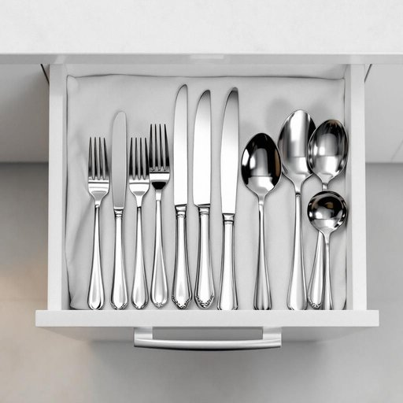

# cutlery

<h1 style="font-size: 2.5em; font-weight: 300; letter-spacing: 2px; margin: 0; color: #2c3e50;">
/ˈkətləri/
</h1>

---

---

## 例句

Before setting the table for tonight’s dinner party, could you please check if the cutlery, including the polished silver knives, forks, and spoons stored in the top drawer next to the dishwasher, has been properly cleaned and arranged, as I want everything to look impeccable when our guests arrive?

*Before(/ˌbiˈfɔr/) setting(/ˈsɛtɪŋ/) the(/ðə/) table(/ˈteɪbəl/) for(/fər/) tonight’s(/tonight’s*/) dinner(/ˈdɪnər/) party,(/ˈpɑrti,/) could(/kʊd/) you(/ju/) please(/pliz/) check(/ʧɛk/) if(/ɪf/) the(/ðə/) cutlery,(/ˈkətləri,/) including(/ˌɪnˈkludɪŋ/) the(/ðə/) polished(/ˈpɑlɪʃt/) silver(/ˈsɪlvər/) knives,(/naɪvz,/) forks,(/fɔrks,/) and(/ənd/) spoons(/spunz/) stored(/stɔrd/) in(/ɪn/) the(/ðə/) top(/tɔp/) drawer(/drɔr/) next(/nɛkst/) to(/tɪ/) the(/ðə/) dishwasher,(/ˈdɪʃˌwɑʃər,/) has(/həz/) been(/bɪn/) properly(/ˈprɑpərli/) cleaned(/klind/) and(/ənd/) arranged,(/əreɪnʤd,/) as(/ɛz/) I(/aɪ/) want(/wɔnt/) everything(/ˈɛvriˌθɪŋ/) to(/tɪ/) look(/lʊk/) impeccable(/ˌɪmˈpɛkəbəl/) when(/wɪn/) our(/ɑr/) guests(/gɛsts/) arrive?(/əraɪv?/)*

**翻译：** 在为今晚的晚宴布置餐桌之前，能否请你检查一下餐具，包括存放在洗碗机旁顶层抽屉里擦得锃亮的银质刀、叉和勺子，是否已经清洗干净并摆放整齐？我希望一切都能完美无瑕，以迎接我们的客人。

---

## 解释

英语单词“cutlery”作为名词，在家居生活用品的语境中主要指用于进餐的刀、叉、勺等餐具，尤其强调这些餐具的整体集合或套装，常用于描述餐桌摆设或厨房储存。例如，在说“set the table with cutlery”时，指的是摆放刀叉勺以备用餐。英语学习者在使用“cutlery”时需注意它通常作为不可数名词出现，表示一类物品的集合，不用复数形式，但在某些特定语境下也可见复数形式“cutleries”，不过较少见且不推荐；常见搭配有“silver cutlery”（银质餐具）、“stainless steel cutlery”（不锈钢餐具）等。此外，应避免将“cutlery”与“crockery”（瓷器）混淆，后者指的是盘子碗等餐具。词源上，“cutlery”来源于中古英语，源自“cutler”，意指制作或销售刀具的工匠，进一步衍生为指代刀叉类餐具的总称。中文中准确的翻译为“餐具”，主要侧重于刀、叉、勺等金属器具，不包括盘子、碗等其他餐具。该词无明显褒贬含义，较为中性且常用于日常生活和家居讨论，文化上体现了西方餐桌礼仪对餐具分类的细致划分，尤其在正式场合强调“cutlery”的规范摆放，反映一定的饮食礼仪规范。

---

<small style="color: #999; font-size: 0.9em;">2025-07-27 09:14:04</small>

