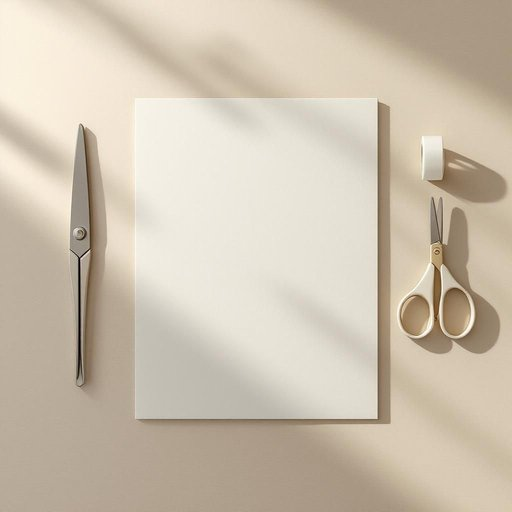

# cutter

<h1 style="font-size: 2.5em; font-weight: 300; letter-spacing: 2px; margin: 0; color: #2c3e50;">
/ˈkətər/
</h1>

---

---

## 例句

Could you please pass me the cutter that’s usually kept in the top drawer next to the scissors and tape, as I need to carefully open this package without damaging the contents inside?

*Could(/kʊd/) you(/ju/) please(/pliz/) pass(/pæs/) me(/mi/) the(/ðə/) cutter(/ˈkətər/) that’s(/that’s*/) usually(/ˈjuʒəwəli/) kept(/kɛpt/) in(/ɪn/) the(/ðə/) top(/tɔp/) drawer(/drɔr/) next(/nɛkst/) to(/tɪ/) the(/ðə/) scissors(/ˈsɪzərz/) and(/ənd/) tape,(/teɪp,/) as(/ɛz/) I(/aɪ/) need(/nid/) to(/tɪ/) carefully(/ˈkɛrfəli/) open(/ˈoʊpən/) this(/ðɪs/) package(/ˈpækɪʤ/) without(/wɪˈθaʊt/) damaging(/ˈdæmɪʤɪŋ/) the(/ðə/) contents(/ˈkɑntɛnts/) inside?(/ˌɪnˈsaɪd?/)*

**翻译：** 请您把通常放在剪刀和胶带旁边上层抽屉里的切割刀递给我，好让我小心地打开这个包裹而不损坏里面的物品。

---

## 解释

英语单词“cutter”在家居生活用品场景中作为名词，通常指用于切割的器具或工具，如切纸刀、切菜刀、饼干切割器等，具体使用场合包括厨房、办公桌以及工艺制作中，常见语境如“cookie cutter”（饼干切模）、“paper cutter”（切纸刀）等。学习者在使用“cutter”时需注意其常见搭配，如“pizza cutter”（披萨切刀）、“box cutter”（开箱刀），通常可直接加在具体物品前表明用途，同时“cutter”作为可数名词需注意单复数形式变换（cutters），在语法上多用作名词使用，不常见作动词。词源来自中古英语“cutten”，源自动词“cut”，加上表示工具的后缀“-er”，即“cut”加“er”表示“切割的工具”，反映其功能本质。在中文语境中，“cutter”准确翻译为“切割器”、“切刀”或根据具体用途翻译为“刀具”、“切割工具”，无明显褒贬色彩，属于中性词汇，日常生活中常见且实用的工具名词，文化内涵较为通用，无特殊寓意或象征。

---

<small style="color: #999; font-size: 0.9em;">2025-07-27 09:14:04</small>

