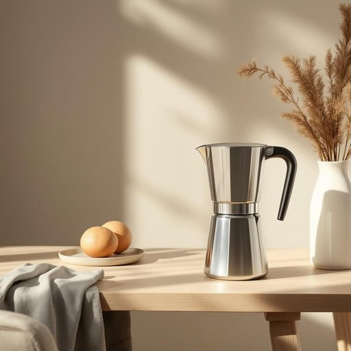

# decater

<h1 style="font-size: 2.5em; font-weight: 300; letter-spacing: 2px; margin: 0; color: #2c3e50;">
/decater*/
</h1>

---

---

## 例句

After noticing that the coffee had lost its warmth within minutes, Emily decided to invest in a decater, which not only preserved the temperature more effectively than a regular pot but also allowed her to serve guests elegantly during weekend brunches, ensuring the rich aroma and full-bodied flavour remained intact throughout the morning.

*After(/ˈæftər/) noticing(/ˈnoʊtɪsɪŋ/) that(/ðət/) the(/ðə/) coffee(/ˈkɔfi/) had(/hæd/) lost(/lɔst/) its(/ɪts/) warmth(/wɔrmθ/) within(/wɪˈθɪn/) minutes,(/ˈmɪnəts,/) Emily(/ˈɛmɪli/) decided(/ˌdɪˈsaɪdɪd/) to(/tɪ/) invest(/ˌɪnˈvɛst/) in(/ɪn/) a(/ə/) decater,(/decater*,/) which(/wɪʧ/) not(/nɑt/) only(/ˈoʊnli/) preserved(/prɪˈzərvd/) the(/ðə/) temperature(/ˈtɛmpərəʧər/) more(/mɔr/) effectively(/ˈifɛktɪvli/) than(/ðən/) a(/ə/) regular(/ˈrɛgjələr/) pot(/pɑt/) but(/bət/) also(/ˈɔlsoʊ/) allowed(/əˈlaʊd/) her(/hər/) to(/tɪ/) serve(/sərv/) guests(/gɛsts/) elegantly(/ˈɛlɪgənˌtli/) during(/ˈdʊrɪŋ/) weekend(/ˈwiˌkɪnd/) brunches,(/ˈbrənʧɪz,/) ensuring(/ɪnˈʃʊrɪŋ/) the(/ðə/) rich(/rɪʧ/) aroma(/ərˈoʊmə/) and(/ənd/) full-bodied(/full-bodied*/) flavour(/flavour*/) remained(/rɪˈmeɪnd/) intact(/ˌɪnˈtækt/) throughout(/θruaʊt/) the(/ðə/) morning.(/ˈmɔrnɪŋ./)*

**翻译：** 注意到咖啡在几分钟内就失去了温度后，艾米丽决定购买一个保温壶，这不仅比普通咖啡壶更有效地保持温度，还让她在周末早午餐时优雅地为客人倒茶，确保浓郁的香气和醇厚的口感整个上午都得以完整呈现。

---

## 解释

英语单词“decater”作为名词在家居生活用品领域是非常罕见且专业的用语，通常指一种专门用于去除织物（如衣物、窗帘等）上的水分和皱纹的工业设备或家用电器，尤其是在纺织护理或家庭洗涤环境中出现较多。其具体使用场合多见于洗衣相关的上下文，例如在描述洗衣房中如何使用设备使布料快速干燥并减少皱折时出现。英语学习者在使用“decater”时应注意其作为名词的单复数形式变化（单数decater，复数decaters），以及其常见搭配，如“drying decater”（干燥去皱机）或“textile decater”（纺织去皱器）；此外，该词较为专业，日常生活中不常用，故尽量根据语境准确选用，避免混淆于类似表示容器的“decanter”。词源上，“decater”源自拉丁语“de-”表示去除，合并“cater”，与加工或处理织物相关的动词形式衍生而来，强调对织物的特殊“处理”过程，最初多用于纺织工业。中文语境中应准确理解为“去皱机”或“水分去除机”，是一种专门的家居或工业设备名称，不同于普通干衣机或熨斗，不含褒贬色彩，属于技术性中性词汇。整体来看，该词在普通家庭生活用语中极少使用，多限于专业纺织护理词汇，学习时应结合具体上下文谨慎对待。

---

<small style="color: #999; font-size: 0.9em;">2025-07-27 09:14:04</small>

