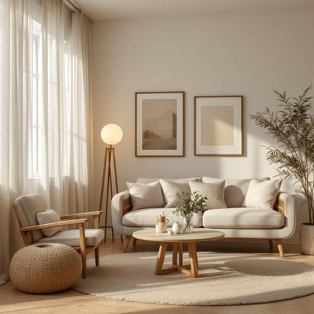

# decor

<h1 style="font-size: 2.5em; font-weight: 300; letter-spacing: 2px; margin: 0; color: #2c3e50;">
/ˈdeɪkɔr/
</h1>

---

---

## 例句

Although the living room was spacious and filled with natural light, it was the subtle choice of vintage furniture, delicate lace curtains, and the carefully curated wall art that truly elevated the decor, giving the space a warm, inviting atmosphere that perfectly balanced both comfort and elegance.

*Although(/ˌɔlˈðoʊ/) the(/ðə/) living(/ˈlɪvɪŋ/) room(/rum/) was(/wɑz/) spacious(/ˈspeɪʃəs/) and(/ənd/) filled(/fɪld/) with(/wɪθ/) natural(/ˈnæʧərəl/) light,(/laɪt,/) it(/ɪt/) was(/wɑz/) the(/ðə/) subtle(/ˈsətəl/) choice(/ʧɔɪs/) of(/əv/) vintage(/ˈvɪntɪʤ/) furniture,(/ˈfərnɪʧər,/) delicate(/ˈdɛləkət/) lace(/leɪs/) curtains,(/ˈkərtənz,/) and(/ənd/) the(/ðə/) carefully(/ˈkɛrfəli/) curated(/curated*/) wall(/wɔl/) art(/ɑrt/) that(/ðət/) truly(/ˈtruli/) elevated(/ˈɛləˌveɪtɪd/) the(/ðə/) decor,(/ˈdeɪkɔr,/) giving(/ˈgɪvɪŋ/) the(/ðə/) space(/speɪs/) a(/ə/) warm,(/wɔrm,/) inviting(/ˌɪnˈvaɪtɪŋ/) atmosphere(/ˈætməsˌfɪr/) that(/ðət/) perfectly(/ˈpərfəktli/) balanced(/ˈbælənst/) both(/boʊθ/) comfort(/ˈkəmfərt/) and(/ənd/) elegance.(/ˈɛləgəns./)*

**翻译：** 尽管客厅宽敞且充满自然光，但正是那些细致挑选的复古家具、精致的蕾丝窗帘以及精心挑选的墙面艺术，真正提升了整体装饰，使空间散发出温馨而宜人的氛围，完美地兼顾了舒适与优雅。

---

## 解释

英语单词“decor”作为名词，主要指室内装修风格和装饰布置，常用于描述家居环境、酒店、大型会场等空间的设计和整体氛围。在家居生活用品的语境中，“decor”通常涉及家具、窗帘、挂画、灯饰、墙面颜色等元素的组合，以营造特定的美感或功能性环境。英语学习者使用“decor”时应注意它通常作为不可数名词使用，表达整体风格时不用复数形式，常见搭配如“home decor”（家居装饰）、“interior decor”（室内装修）、“modern decor”（现代装修风格）等，表达时多用名词短语，如“the decor of the living room”，而非简单形容词作定语。此外，“decor”强调的是环境布置的整体艺术效果，而非单一物品，因此理解其指向整体氛围尤为关键。词源上，“decor”来源于法语“décor”，其起源可追溯到拉丁语“decorare”，意为装饰、布置，带有美化环境的意义。中文语境中，“decor”通常翻译为“装饰风格”或“装修布置”，但应区别于一般的“装饰品”，强调的是整体设计和氛围的塑造，没有褒贬色彩，属于中性词，更多体现艺术审美和空间功能协调。在使用时，需避免将其简单理解为物品名称，而应把握其指代空间和环境氛围的抽象层面，从而准确表达室内设计相关的概念。

---

<small style="color: #999; font-size: 0.9em;">2025-07-27 09:14:04</small>

