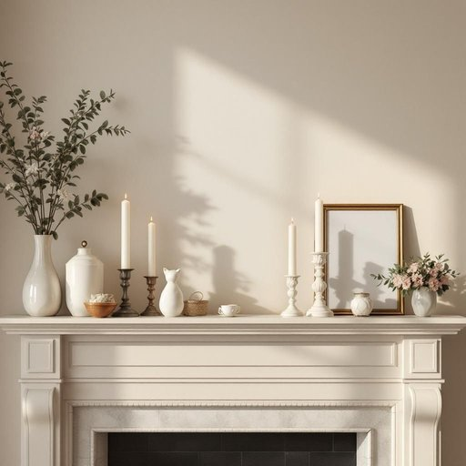

# decoration

<h1 style="font-size: 2.5em; font-weight: 300; letter-spacing: 2px; margin: 0; color: #2c3e50;">
/ˌdɛkərˈeɪʃən/
</h1>

---

---

## 例句

The mantelpiece, adorned with vintage candles, delicate porcelain figurines, and a carefully curated collection of framed family photos, serves as a nostalgic centerpiece that enriches the living room's ambiance with warmth and personal history.

*The(/ðə/) mantelpiece,(/mantelpiece*,/) adorned(/əˈdɔrnd/) with(/wɪθ/) vintage(/ˈvɪntɪʤ/) candles,(/ˈkændəlz,/) delicate(/ˈdɛləkət/) porcelain(/ˈpɔrsələn/) figurines,(/ˌfɪgjərˈinz,/) and(/ənd/) a(/ə/) carefully(/ˈkɛrfəli/) curated(/curated*/) collection(/kəˈlɛkʃən/) of(/əv/) framed(/freɪmd/) family(/ˈfæməli/) photos,(/ˈfoʊˌtoʊz,/) serves(/sərvz/) as(/ɛz/) a(/ə/) nostalgic(/nɔˈstælʤɪk/) centerpiece(/ˈsɛntərˌpis/) that(/ðət/) enriches(/ɛnˈrɪʧɪz/) the(/ðə/) living(/ˈlɪvɪŋ/) room's(/rumz/) ambiance(/ˈæmbiəns/) with(/wɪθ/) warmth(/wɔrmθ/) and(/ənd/) personal(/ˈpərsɪnəl/) history.(/ˈhɪstəri./)*

**翻译：** 壁炉架上陈列着古董蜡烛、精致的瓷器小雕像，以及精心挑选的家族照片合集，成为一处充满怀旧情怀的核心装饰，为客厅增添了温馨与浓厚的个人历史气息。

---

## 解释

英语单词“decoration”作为名词，在家居生活用品的语境中通常指用于美化或装饰室内外环境的物品或装饰行为，如挂画、花瓶、壁纸、灯饰等，用以提升居住空间的视觉效果和氛围。具体使用场合包括家居陈设、节日布置、室内设计讨论等，如“The Christmas decorations are very festive”（圣诞装饰非常有节日气氛）。英语学习者在使用“decoration”时需注意其可数与不可数的用法：作为具体物品时可数（a decoration），指单个装饰品；泛指装饰行为或装饰风格时多为不可数，同时该词常与介词“for”（decoration for the room）或复数形式搭配（holiday decorations）出现，此外，常见固定搭配包括“wall decoration”（墙面装饰）、“holiday decoration”（节日装饰）、“home decoration”（家居装饰）等。词源方面，“decoration”源自拉丁语“decorare”，意为“使美丽”，通过古法语进入英语，强调使环境具备美学价值的行为或物品。在中文环境中，“decoration”准确翻译为“装饰”“装饰品”或“装饰物”，体现了对空间美化的功能性和审美性理解，通常无明显褒贬色彩，但在语境中若指“过度装饰”可能含贬义，暗示不必要的华丽或繁复。总的来说，“decoration”在家居生活中是一种中性词，主要强调通过各种设计或物件来提升生活环境的美观与舒适度。

---

<small style="color: #999; font-size: 0.9em;">2025-07-27 09:14:04</small>

