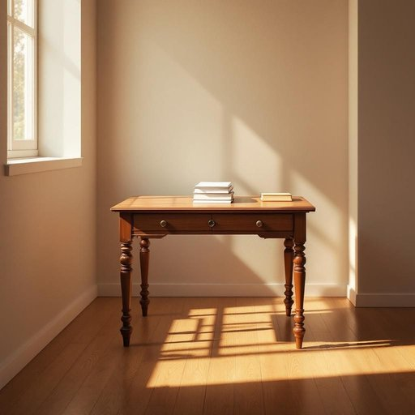

# desk

<h1 style="font-size: 2.5em; font-weight: 300; letter-spacing: 2px; margin: 0; color: #2c3e50;">
/dɛsk/
</h1>

---

---

## 例句

After tidying up the living room, she carefully arranged the stack of important documents on the antique mahogany desk, which stood by the window bathed in soft afternoon light, knowing that its spacious drawers would keep her paperwork neatly organised and easily accessible for when she started her project later in the evening.

*After(/ˈæftər/) tidying(/tidying*/) up(/əp/) the(/ðə/) living(/ˈlɪvɪŋ/) room,(/rum,/) she(/ʃi/) carefully(/ˈkɛrfəli/) arranged(/əreɪnʤd/) the(/ðə/) stack(/stæk/) of(/əv/) important(/ˌɪmˈpɔrtənt/) documents(/ˈdɑkjəmənts/) on(/ɔn/) the(/ðə/) antique(/ænˈtik/) mahogany(/məˈhɑgəni/) desk,(/dɛsk,/) which(/wɪʧ/) stood(/stʊd/) by(/baɪ/) the(/ðə/) window(/ˈwɪndoʊ/) bathed(/beɪðd/) in(/ɪn/) soft(/sɔft/) afternoon(/ˌæftərˈnun/) light,(/laɪt,/) knowing(/noʊɪŋ/) that(/ðət/) its(/ɪts/) spacious(/ˈspeɪʃəs/) drawers(/drɔrz/) would(/wʊd/) keep(/kip/) her(/hər/) paperwork(/ˈpeɪpərˌwərk/) neatly(/ˈnitli/) organised(/organised*/) and(/ənd/) easily(/ˈizəli/) accessible(/ækˈsɛsəbəl/) for(/fər/) when(/wɪn/) she(/ʃi/) started(/ˈstɑrtɪd/) her(/hər/) project(/ˈprɑʤɛkt/) later(/ˈleɪtər/) in(/ɪn/) the(/ðə/) evening.(/ˈivnɪŋ./)*

**翻译：** 整理好客厅后，她将那堆重要文件小心地摆放在靠窗的古董红木书桌上，柔和的下午光洒落其上。她知道，这张宽敞的抽屉能让她的文件整齐有序，便于晚上开始项目时随手取用。

---

## 解释

英语单词“desk”作为名词在家居生活用品场景中，通常指供写字、阅读、工作或学习用的有桌面和通常带抽屉或储物空间的家具。具体使用场合多见于家庭办公室、书房、学生的学习环境或办公室空间，如“study desk”（学习桌）、“computer desk”（电脑桌）等。英语学习者使用“desk”时需注意其为可数名词，复数形式为“desks”，且常与表示功能或位置的名词、形容词连用，如“wooden desk”（木制书桌）、“office desk”（办公桌）等，此外常用搭配还有“sit at a desk”（坐在桌前）、“clean the desk”（擦桌子）等。词源方面，“desk”来源于中古英语“deske”，源自拉丁语“discus”，意指圆盘或盘子，后来引申为写字台的意思，显示出家具功能上的演变。在中文语境中，“desk”准确对应“书桌”或“办公桌”等词，强调的是带有一定收纳功能且专门供工作或学习使用的桌子，区别于简单的“桌子”或“桌台”。“desk”一般为中性词，无特别的褒贬含义，但根据具体搭配和语境，其功能性和正式感较强，反映工作或学习效率的文化内涵较为明显。

---

<small style="color: #999; font-size: 0.9em;">2025-07-27 09:14:04</small>

