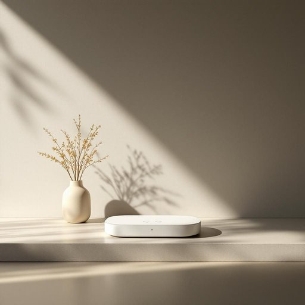

# device

<h1 style="font-size: 2.5em; font-weight: 300; letter-spacing: 2px; margin: 0; color: #2c3e50;">
/dɪˈvaɪs/
</h1>

---

---

## 例句

The advanced security device, equipped with multiple sensors and AI-powered analytics, automatically detects unusual activity around the premises while simultaneously notifying the homeowner and local authorities, ensuring a rapid response that enhances both safety and peace of mind.

*The(/ðə/) advanced(/ədˈvænst/) security(/sɪˈkjʊrəti/) device,(/dɪˈvaɪs,/) equipped(/ɪkˈwɪpt/) with(/wɪθ/) multiple(/ˈməltəpəl/) sensors(/ˈsɛnsərz/) and(/ənd/) AI-powered(/ai-powered*/) analytics,(/ˌænəˈlɪtɪks,/) automatically(/ˌɔtəˈmætɪkli/) detects(/dɪˈtɛkts/) unusual(/ənˈjuˌʒuəl/) activity(/ækˈtɪvɪti/) around(/əraʊnd/) the(/ðə/) premises(/ˈprɛməsəz/) while(/waɪl/) simultaneously(/ˌsaɪməlˈteɪniəsli/) notifying(/ˈnoʊtəˌfaɪɪŋ/) the(/ðə/) homeowner(/ˈhoʊˌmoʊnər/) and(/ənd/) local(/ˈloʊkəl/) authorities,(/əˈθɔrətiz,/) ensuring(/ɪnˈʃʊrɪŋ/) a(/ə/) rapid(/ˈræpɪd/) response(/rɪˈspɑns/) that(/ðət/) enhances(/ɛnˈhænsɪz/) both(/boʊθ/) safety(/ˈseɪfti/) and(/ənd/) peace(/pis/) of(/əv/) mind.(/maɪnd./)*

**翻译：** 这款先进的安全设备配备了多种传感器和人工智能驱动的分析系统，能够自动检测场所周围的异常活动，同时即时通知房主及当地相关部门，确保迅速响应，从而提升安全性与安心感。

---

## 解释

英语单词“device”作为名词在家居生活用品的语境中，通常指的是各种用来完成特定功能的工具或装置，如厨房用具（如咖啡机、果汁机）、家用电器（如空气净化器、智能恒温器）等，强调其实用性和技术性。使用时，学习者需注意“device”通常是可数名词，常见搭配有“electronic device”（电子设备）、“household device”（家用设备）、“security device”（安防装置）等，常用于描述一般的机械或电子工具，且在句中常作主语或宾语。此外，device在语法上可接of结构表示某装置的用途或特征，如“a device for measuring temperature”。词源上，“device”源自中古英语，借自古法语“devis”，意为设计、布置，进一步追溯到拉丁语“divisare”，表示分配、计划，体现了“device”作为设计和发明物的含义。在中文语境中，“device”通常翻译为“装置”、“设备”或“器具”，具体含义根据情境决定，既可以指简单的机械工具，也可以指较为复杂的电子产品，无明显褒贬色彩，属于中性词汇，通常强调其功能性和实用性，但在口语或非专业场合也可能泛指任何小型工具或器件。综上，“device”在描述家居生活用品时，是一个涵盖广泛、用法灵活且语义明确的词汇，适合表达现代家庭中的各种实用设备。

---

<small style="color: #999; font-size: 0.9em;">2025-07-27 09:14:04</small>

