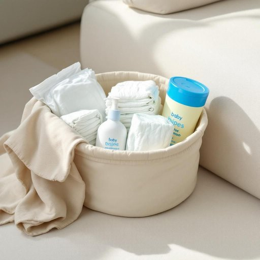

# diaper

<h1 style="font-size: 2.5em; font-weight: 300; letter-spacing: 2px; margin: 0; color: #2c3e50;">
/ˈdaɪpər/
</h1>

---

---

## 例句

Could you please check if there's a fresh diaper in the changing basket by the sofa, along with the wipes and creams, before I settle the little one down for a nap?

*Could(/kʊd/) you(/ju/) please(/pliz/) check(/ʧɛk/) if(/ɪf/) there's(/ðɛrz/) a(/ə/) fresh(/frɛʃ/) diaper(/ˈdaɪpər/) in(/ɪn/) the(/ðə/) changing(/ˈʧeɪnʤɪŋ/) basket(/ˈbæskət/) by(/baɪ/) the(/ðə/) sofa,(/ˈsoʊfə,/) along(/əˈlɔŋ/) with(/wɪθ/) the(/ðə/) wipes(/waɪps/) and(/ənd/) creams,(/krimz,/) before(/ˌbiˈfɔr/) I(/aɪ/) settle(/ˈsɛtəl/) the(/ðə/) little(/ˈlɪtəl/) one(/wən/) down(/daʊn/) for(/fər/) a(/ə/) nap?(/næp?/)*

**翻译：** 请您帮忙确认一下沙发旁的换尿布篮里是否有新的尿布，还有湿巾和护肤霜，以便我给小宝宝安顿午睡。

---

## 解释

英语单词“diaper”作为名词，主要指婴儿使用的尿布，属于家居生活用品范畴，常用于照顾婴幼儿的环境中，如家庭育儿、托儿所或医院等场合。“diaper”通常指可一次性使用的婴儿尿布，也可以指布制尿布，但现代语境中多指一次性产品。英语学习者在使用“diaper”时应注意其可数性质，常见表达包括“change a diaper”（更换尿布）、“put on a diaper”（给婴儿穿尿布）、“disposable diaper”（一次性尿布）和“cloth diaper”（布尿布），词义和搭配较为固定，且“diaper”作名词时一般不用复数形式表示尿布的类别，复数形式“diapers”常指多片尿布。词源方面，“diaper”起源于14世纪晚期，来源于中古英语“diaper”意为斜纹织物，有细小重复图案，后来因最早的布尿布常用此类织物而得名，随后演变专指婴儿的尿布。在中文语境中，“diaper”准确翻译为“尿布”，且该词无贬义，属于中性词汇，用于描述婴幼儿护理用品，文化内涵较为直接关联于婴幼儿的卫生和护理，涉及婴幼儿成长和家庭照护相关话题时频繁出现。

---

<small style="color: #999; font-size: 0.9em;">2025-07-27 09:14:04</small>

