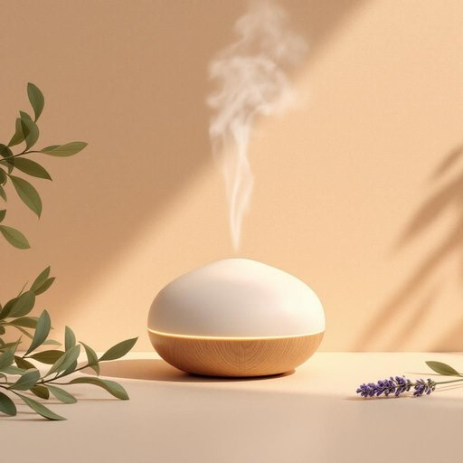

# diffuser

<h1 style="font-size: 2.5em; font-weight: 300; letter-spacing: 2px; margin: 0; color: #2c3e50;">
/diffuser*/
</h1>

---

---

## 例句

I bought a new diffuser for the living room, which, besides subtly dispersing the lavender scent that helps me relax after a long day, also serves as a stylish piece of decor thanks to its sleek design and soft ambient lighting.

*I(/aɪ/) bought(/bɔt/) a(/ə/) new(/nu/) diffuser(/diffuser*/) for(/fər/) the(/ðə/) living(/ˈlɪvɪŋ/) room,(/rum,/) which,(/wɪʧ,/) besides(/ˌbiˈsaɪdz/) subtly(/ˈsətəli/) dispersing(/dɪˈspərsɪŋ/) the(/ðə/) lavender(/ˈlævəndər/) scent(/sɛnt/) that(/ðət/) helps(/hɛlps/) me(/mi/) relax(/rɪˈlæks/) after(/ˈæftər/) a(/ə/) long(/lɔŋ/) day,(/deɪ,/) also(/ˈɔlsoʊ/) serves(/sərvz/) as(/ɛz/) a(/ə/) stylish(/ˈstaɪlɪʃ/) piece(/pis/) of(/əv/) decor(/ˈdeɪkɔr/) thanks(/θæŋks/) to(/tɪ/) its(/ɪts/) sleek(/slik/) design(/dɪˈzaɪn/) and(/ənd/) soft(/sɔft/) ambient(/ˈæmbiənt/) lighting.(/ˈlaɪtɪŋ./)*

**翻译：** 我为客厅买了一个新的香薰机，除了能微妙地弥散薰衣草的香气，帮助我在漫长一天后放松身心外，其流畅的设计和柔和的环境灯光也使它成为一件时尚的装饰品。

---

## 解释

“diffuser”作为名词在家居生活用品的场景中，通常指的是一种用来分散香薰油、空气或光线的装置。具体使用场合包括室内空气香薰机中的香薰扩散器，通过电热或超声波技术将精油分散到空气中，帮助营造舒适的环境氛围；也可指灯具中的光罩，用于柔化和扩散光线，使照明更均匀柔和。英语学习者在使用该词时要注意，“diffuser”一般作可数名词出现，可与定冠词、不定冠词或数量词连用，如“a diffuser”，“two diffusers”；其搭配常见有“aroma diffuser”（香薰扩散器）、“essential oil diffuser”（精油扩散器）及“light diffuser”（光线扩散器）。此外，该词的动词形式是“diffuse”，意为“扩散”，与“diffuser”作为名词的角色保持对应关系。词源上，“diffuser”源自拉丁语“diffundere”，意指“散开、扩散”，由前缀“dis-”加动词“fundere”（倒出）组成，形象表达其扩散开来的功能。在中文语境中，“diffuser”常被准确翻译为“扩散器”或“香薰机/香薰扩散器”，根据具体功能而定。该词本身中性无褒贬含义，属于技术性、功能性较强的生活用品词汇，使用时注意区分不同类型的扩散器。此外，英语中“diffuser”也有其他专业领域含义，如音响扩散器或汽车部件，但在家居用品语境中主要指空气或光线的扩散装置。整体来看，掌握其具体用法和搭配，有助于准确表达相关家居生活场景中的设备功能。

---

<small style="color: #999; font-size: 0.9em;">2025-07-27 09:14:04</small>

