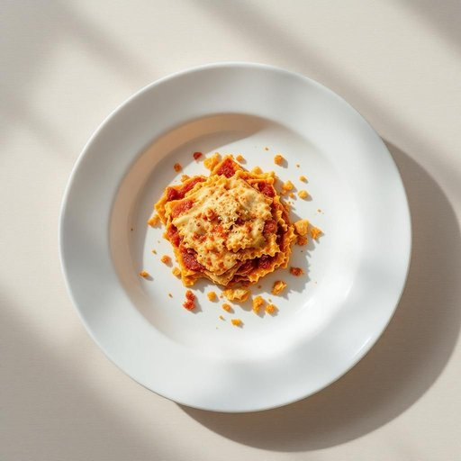

# dish

<h1 style="font-size: 2.5em; font-weight: 300; letter-spacing: 2px; margin: 0; color: #2c3e50;">
/dɪʃ/
</h1>

---

---

## 例句

Could you please wash the dish that’s been sitting in the sink since this morning, the one with the stubborn bits of lasagne stuck to it, before we start preparing dinner together?

*Could(/kʊd/) you(/ju/) please(/pliz/) wash(/wɑʃ/) the(/ðə/) dish(/dɪʃ/) that’s(/that’s*/) been(/bɪn/) sitting(/ˈsɪtɪŋ/) in(/ɪn/) the(/ðə/) sink(/sɪŋk/) since(/sɪns/) this(/ðɪs/) morning,(/ˈmɔrnɪŋ,/) the(/ðə/) one(/wən/) with(/wɪθ/) the(/ðə/) stubborn(/ˈstəbərn/) bits(/bɪts/) of(/əv/) lasagne(/lasagne*/) stuck(/stək/) to(/tɪ/) it,(/ɪt,/) before(/ˌbiˈfɔr/) we(/wi/) start(/stɑrt/) preparing(/pərˈpɛrɪŋ/) dinner(/ˈdɪnər/) together?(/təˈgɛðər?/)*

**翻译：** 你能在我们一起动手准备晚餐之前，把那只从早上开始就放在水槽里，带着难洗干净的千层面残渣的碗洗一下吗？

---

## 解释

英语单词"dish"作为名词在家居生活用品的语境中，主要指用来盛放或烹饪食物的盘子、碟子或碗等餐具，具体使用场合包括餐桌上用来装食物的器皿，如“a ceramic dish”（陶瓷盘）或“a serving dish”（上菜盘）。学习者在使用时应注意，其复数形式为"dishes"，指多个盘子或餐具；此外，"dish"也可指一道菜肴，这在表达上有区别，需根据语境判断。在搭配方面常见短语有“wash the dishes”（洗碗碟）、“a dish of salad”（一盘沙拉）等，强调具体器皿时要区分与“plate”（盘子）或“bowl”（碗）的差异。"Dish"一词源自中古英语，来自古法语“dische”，进一步源自拉丁语“discus”，意为圆盘，这与其形状和功能密切相关。在中文语境中，"dish"通常准确翻译为“盘子”或“碟子”，根据具体形状与用途可做细分。需要注意的是，尽管“dish”在餐具含义中较为中性，非正式口语中有时用作俚语带有轻微贬义（如用来形容某人“很有吸引力”时），但在家居用品语境中无特殊褒贬色彩，纯粹指代器皿。总的来说，掌握"dish"在餐具语境中的准确含义及其复数和常见搭配，有助于学习者更自然地表达与饮食相关的生活情境。

---

<small style="color: #999; font-size: 0.9em;">2025-07-27 09:14:04</small>

