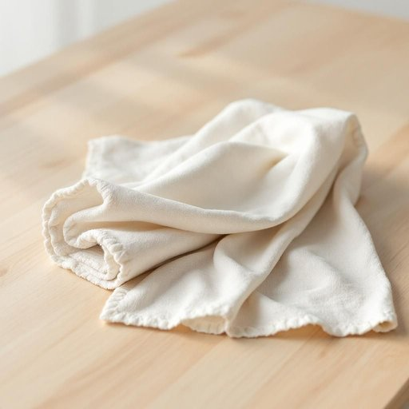

# dishcloth

<h1 style="font-size: 2.5em; font-weight: 300; letter-spacing: 2px; margin: 0; color: #2c3e50;">
/dishcloth*/
</h1>

---

---

## 例句

After the intense meeting, his patience was stretched to the limit, as the constant interruptions disrupted the flow of ideas and tested his ability to remain composed under pressure.

*After(/ˈæftər/) the(/ðə/) intense(/ˌɪnˈtɛns/) meeting,(/ˈmitɪŋ,/) his(/hɪz/) patience(/ˈpeɪʃəns/) was(/wɑz/) stretched(/strɛʧt/) to(/tɪ/) the(/ðə/) limit,(/ˈlɪmət,/) as(/ɛz/) the(/ðə/) constant(/ˈkɑnstənt/) interruptions(/ˌɪntərˈəpʃənz/) disrupted(/dɪsˈrəptɪd/) the(/ðə/) flow(/floʊ/) of(/əv/) ideas(/aɪˈdiəz/) and(/ənd/) tested(/ˈtɛstɪd/) his(/hɪz/) ability(/əˈbɪləˌti/) to(/tɪ/) remain(/rɪˈmeɪn/) composed(/kəmˈpoʊzd/) under(/ˈəndər/) pressure.(/ˈprɛʃər./)*

**翻译：** 激烈的会议结束后，他的耐心被磨到了极限，频繁的打断扰乱了思路的连贯，也考验着他在压力下保持冷静的能力。

---

## 解释

"dishcloth"作为英语中名词，主要指厨房中用来擦洗盘子、餐具等餐厨用具的布块，常见于家庭和餐馆的日常清洁环境。具体使用场合通常是在厨房洗碗或擦拭厨房台面时提及，例如“Wipe the table with a clean dishcloth”（用干净的洗碗布擦桌子）。英语学习者需注意，“dishcloth”是不可数名词时通常指布材质的洗碗布整体概念，但也可以作为可数名词出现，表示一块或几块洗碗布，如“two dishcloths”（两块洗碗布）；此外它与动词搭配常用“use a dishcloth to clean/wipe”等，语法较简单，无特殊时态或复数形式的复杂变化。词源方面，“dishcloth”由“dish”（盘子）和“cloth”（布）组合而成，意为“用于盘子的布”，反映了其功能性的命名特点，无特殊隐喻或引申义，属于复合词范畴。在中文语境中，“dishcloth”通常准确翻译为“洗碗布”或“擦碗布”，涵盖了其在厨房清洁中的实际用途，既可指传统棉质布块，也涵盖现代纤维或海绵材质的类似清洁用具。此词语无明显褒贬含义，属于中性实用词汇，在家居生活用品语境中使用广泛，体现了对象与用途的紧密联系，便于语言学习者根据场合准确理解和运用。

---

<small style="color: #999; font-size: 0.9em;">2025-07-27 09:14:04</small>

