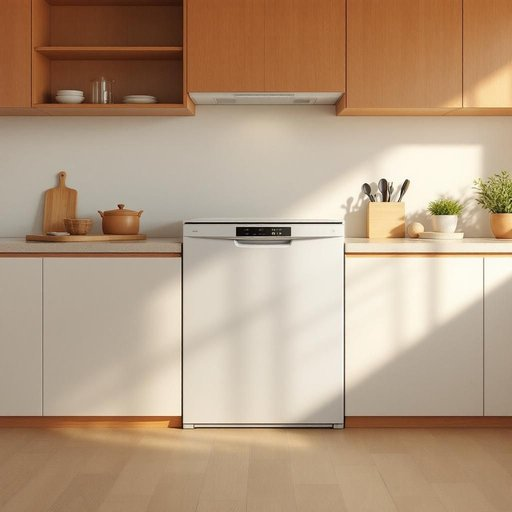

# dishwasher

<h1 style="font-size: 2.5em; font-weight: 300; letter-spacing: 2px; margin: 0; color: #2c3e50;">
/ˈdɪʃˌwɑʃər/
</h1>

---

---

## 例句

After we finished dinner, the dishwasher's capacity was carefully managed by loading plates, cutlery, and glasses smeared with sauce, ensuring not to overcrowd it so that the cleaning cycle would produce sparkling results by the start of the movie.

*After(/ˈæftər/) we(/wi/) finished(/ˈfɪnɪʃt/) dinner,(/ˈdɪnər,/) the(/ðə/) dishwasher's(/dishwasher's*/) capacity(/kəˈpæsɪti/) was(/wɑz/) carefully(/ˈkɛrfəli/) managed(/ˈmænɪʤd/) by(/baɪ/) loading(/ˈloʊdɪŋ/) plates,(/pleɪts,/) cutlery,(/ˈkətləri,/) and(/ənd/) glasses(/ˈglæsɪz/) smeared(/smɪrd/) with(/wɪθ/) sauce,(/sɔs,/) ensuring(/ɪnˈʃʊrɪŋ/) not(/nɑt/) to(/tɪ/) overcrowd(/ˌoʊvərˈkraʊd/) it(/ɪt/) so(/soʊ/) that(/ðət/) the(/ðə/) cleaning(/ˈklinɪŋ/) cycle(/ˈsaɪkəl/) would(/wʊd/) produce(/ˈproʊdus/) sparkling(/ˈspɑrkəlɪŋ/) results(/rɪˈzəlts/) by(/baɪ/) the(/ðə/) start(/stɑrt/) of(/əv/) the(/ðə/) movie.(/ˈmuvi./)*

**翻译：** 晚餐结束后，我们合理安排洗碗机的容量，将沾有酱汁的盘子、餐具和玻璃杯井然有序地放入，避免堆叠过密，以确保洗涤程序能在电影开始前将其洗净如新。

---

## 解释

“dishwasher”作为名词，主要指家用或商用的洗碗机，是一种用于自动清洗餐具、杯盘碟等厨房器具的电器设备，常见于家庭厨房、餐厅或其他需要大量清洗餐具的场合。英语学习者在使用这个词时需注意其结构为复合名词，由“dish”（盘子、餐具）和“washer”（清洗器）组成，通常作为单数名词使用，复数形式为“dishwashers”，且常与动词“to use”或“to run”搭配，如“to run the dishwasher”（启动洗碗机）。此外，“dishwasher”也可以作形容词使用，修饰其他名词，例如“dishwasher detergent”（洗碗机专用洗涤剂）。词源方面，“dishwasher”源自英语日常生活中，将“dish”（餐具）与“washer”（清洗者，清洗机）合成的复合词，反映了工业化和生活便利化的发展背景。在中文环境下，“dishwasher”通常准确翻译为“洗碗机”，是家用电器中的常见名词，强调其自动化清洗餐具的功能，没有特殊的褒贬或情感色彩，文化内涵上体现了现代家庭对时间和劳动效率的追求。总之，“dishwasher”在家居生活用品场景中指的是一种自动化清洗餐具的设备，语法使用灵活，表达清晰，符合现代生活节奏和便利需求。

---

<small style="color: #999; font-size: 0.9em;">2025-07-27 09:14:04</small>

