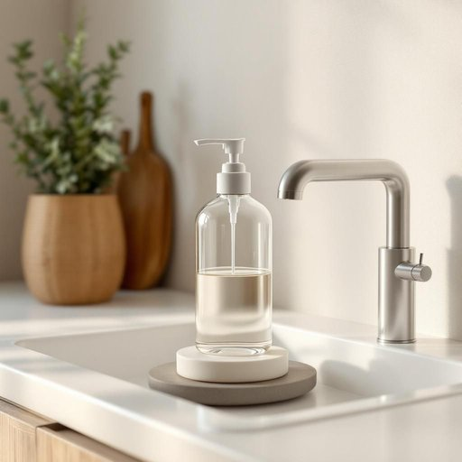

# dispenser

<h1 style="font-size: 2.5em; font-weight: 300; letter-spacing: 2px; margin: 0; color: #2c3e50;">
/dɪˈspɛnsər/
</h1>

---

---

## 例句

Could you please refill the soap dispenser in the kitchen sink, which has been nearly empty for days and is causing quite a nuisance whenever someone tries to wash their hands after gardening or cooking?

*Could(/kʊd/) you(/ju/) please(/pliz/) refill(/ˈrifɪl/) the(/ðə/) soap(/soʊp/) dispenser(/dɪˈspɛnsər/) in(/ɪn/) the(/ðə/) kitchen(/ˈkɪʧən/) sink,(/sɪŋk,/) which(/wɪʧ/) has(/həz/) been(/bɪn/) nearly(/ˈnɪrli/) empty(/ˈɛmti/) for(/fər/) days(/deɪz/) and(/ənd/) is(/ɪz/) causing(/ˈkɔzɪŋ/) quite(/kwaɪt/) a(/ə/) nuisance(/ˈnusəns/) whenever(/wɛˈnɛvər/) someone(/ˈsəmˌwən/) tries(/traɪz/) to(/tɪ/) wash(/wɑʃ/) their(/ðɛr/) hands(/hænz/) after(/ˈæftər/) gardening(/ˈgɑrdənɪŋ/) or(/ər/) cooking?(/ˈkʊkɪŋ?/)*

**翻译：** 请您帮忙重新加满厨房水槽旁的洗手液瓶，那个瓶子已经空了好几天，每当有人做园艺或做饭后想洗手时，都造成了不少不便。

---

## 解释

英语单词“dispenser”在家居生活用品场景中作为名词，通常指用于存放并方便取用某种物品的装置或容器，如纸巾盒（tissue dispenser）、肥皂液瓶（soap dispenser）、饮水机（water dispenser）等，具体使用场合多见于厨房、浴室或餐厅等需要有序分发和取用物品的环境。英语学习者在使用该词时应注意它是可数名词，常见搭配包括“soap dispenser”（肥皂分配器）、“hand sanitizer dispenser”（洗手液分配器）和“tape dispenser”（胶带座），表达中通常结合所分发的物品来使用，以明确其功能和指代对象。语法上，“dispenser”常用作单数或复数形式“dispensers”，且多用作名词位于句中主语或宾语位置，动词搭配多为“use a dispenser”或“install a dispenser”等。该词源自拉丁语“dispensare”，意为“分配、配给”，通过法语借入英语，体现了其“分发、分配”的本义。中文中，“dispenser”准确理解为“分配器”或“分发器”，在家用语境下多译作“（某物）分配器”、“（某物）分发器”或根据具体功能简称为“（某物）盒”、“瓶”等，无褒贬色彩，属于中性词，文化内涵也较为普遍，指代方便使用和节省资源的家用小工具，强调实用性和便利性。

---

<small style="color: #999; font-size: 0.9em;">2025-07-27 09:14:04</small>

