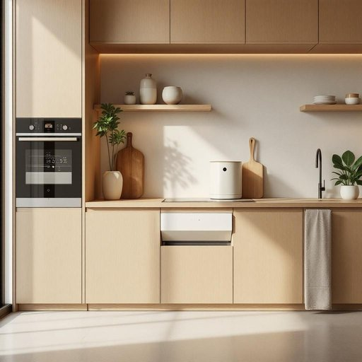

# disposal

<h1 style="font-size: 2.5em; font-weight: 300; letter-spacing: 2px; margin: 0; color: #2c3e50;">
/dɪˈspoʊzəl/
</h1>

---

---

## 例句

Before renovating the kitchen, the decision between the waste disposal’s efficiency and the system’s modern benefits requires careful consideration.

*Before(/ˌbiˈfɔr/) renovating(/ˈrɛnəˌveɪtɪŋ/) the(/ðə/) kitchen,(/ˈkɪʧən,/) the(/ðə/) decision(/dɪˈsɪʒən/) between(/bɪtˈwin/) the(/ðə/) waste(/weɪst/) disposal’s(/disposal’s*/) efficiency(/ɪˈfɪʃənsi/) and(/ənd/) the(/ðə/) system’s(/system’s*/) modern(/ˈmɑdərn/) benefits(/ˈbɛnəfɪts/) requires(/rikˈwaɪərz/) careful(/ˈkɛrfəl/) consideration.(/kənˌsɪdərˈeɪʃən./)*

**翻译：** 在翻新厨房之前，需认真权衡垃圾处理装置的效率与系统现代化优势之间的选择。

---

## 解释

英语单词“disposal”在家居生活用品场景中作为名词，主要指“处理、处置”或“丢弃”，尤指对废弃物、垃圾或不再需要物品的清理方式；常见的具体用法包括“garbage disposal”（厨房垃圾处理器），即安装在水槽下用来粉碎和排放厨余垃圾的设备。“disposal”在语法上通常作为不可数或可数名词出现，表示“处理”这一抽象行为时为不可数，但在表达具体设备或方式时可用作可数名词，英语学习者应注意其与动词“dispose”形成的名词化用法，其常见搭配包括“at sb’s disposal”（由某人支配）；“disposal of waste”（废物处理）；“garbage disposal unit”等，“disposal”本身不可直接与动词搭配形成动作，应通过固定短语或介词搭配表达处理行为。该词源自拉丁语“disponere”，意为“安排、处理”，经过古法语传入英语，演变出“处置、安排”的含义。在中文语境中，“disposal”准确对应为“处理”、“处置”或“丢弃”，根据具体语境可译为“废物处理”、“垃圾处理”、“处置方式”等，语义较为中性，无明显褒贬色彩，但用于描述居家生活用品时，通常指对废弃物的有效处理，具有环保和卫生的积极含义，文化上强调社会对垃圾和废弃物规范管理的重视。

---

<small style="color: #999; font-size: 0.9em;">2025-07-27 09:14:04</small>

