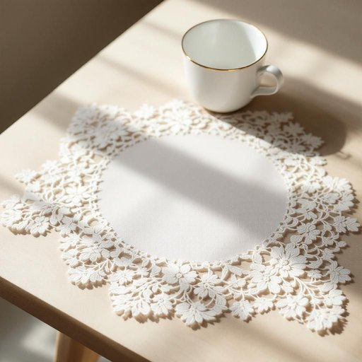

# doily

<h1 style="font-size: 2.5em; font-weight: 300; letter-spacing: 2px; margin: 0; color: #2c3e50;">
/ˈdɔɪli/
</h1>

---

---

## 例句

Could you please pass me the doily that’s embroidered with lace and has that delicate floral pattern, the one Grandma used to place under her teacups to catch any spills and add a touch of elegance to the table setting?

*Could(/kʊd/) you(/ju/) please(/pliz/) pass(/pæs/) me(/mi/) the(/ðə/) doily(/ˈdɔɪli/) that’s(/that’s*/) embroidered(/ɛmˈbrɔɪdərd/) with(/wɪθ/) lace(/leɪs/) and(/ənd/) has(/həz/) that(/ðət/) delicate(/ˈdɛləkət/) floral(/ˈflɔrəl/) pattern,(/ˈpætərn,/) the(/ðə/) one(/wən/) Grandma(/ˈgrændmɑ/) used(/juzd/) to(/tɪ/) place(/pleɪs/) under(/ˈəndər/) her(/hər/) teacups(/teacups*/) to(/tɪ/) catch(/kæʧ/) any(/ˈɛni/) spills(/spɪlz/) and(/ənd/) add(/æd/) a(/ə/) touch(/təʧ/) of(/əv/) elegance(/ˈɛləgəns/) to(/tɪ/) the(/ðə/) table(/ˈteɪbəl/) setting?(/ˈsɛtɪŋ?/)*

**翻译：** 你能帮我递一下那块绣着蕾丝、带有精致花卉图案的餐巾吗？就是奶奶以前放在茶杯下用来接住溢出的茶水，并为餐桌增添一丝雅致的那块。

---

## 解释

"Doily"作为名词主要指一种用于餐桌或家具表面的装饰性小垫子，通常由蕾丝、纸或织物制成，形状多为圆形或椭圆形，精致而带有花纹。这种物品常见于家居生活中，用于放置茶具、蛋糕盘或花瓶，既保护桌面防止划伤或污渍，又起到美化环境的作用。英语学习者在使用"doily"时需注意该词通常用于可数名词形式，复数为"doilies"；表达时常与表示用途的短语搭配，如"lace doily"（蕾丝垫）、"paper doily"（纸垫）或"place a doily under..."，且"doily"多数用作具体物品名词，不宜泛指任何桌布。词源上，"doily"来源于17世纪英国，最初是指一个名叫Doily的服装商人，据说其以生产便宜的面料闻名，后来逐渐将其名字引申为小而精致的装饰布垫。中文语境中，"doily"准确翻译为“餐巾垫”或“蕾丝垫”，反映其在桌面装饰中的使用价值。需要注意的是，"doily"在英语中带有一定的复古和温馨的居家氛围，使用时常给人一种传统、优雅甚至略带老派的感觉，没有褒贬色彩，但有时会被用来形容过于繁复或陈旧的装饰风格，从而带有轻微的戏谑意味。总体而言，该词与家庭生活中精致细节相关联，体现了英美文化中对餐桌礼仪及室内美化的小巧心思。

---

<small style="color: #999; font-size: 0.9em;">2025-07-27 09:14:04</small>

