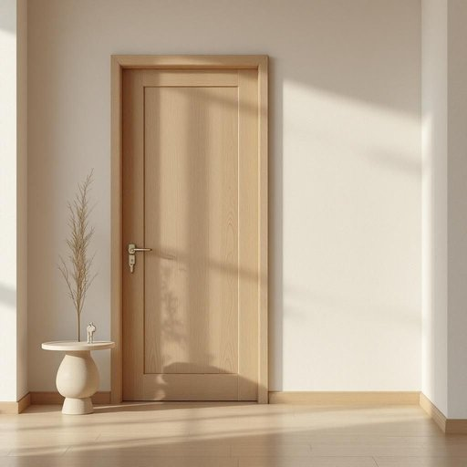

# door

<h1 style="font-size: 2.5em; font-weight: 300; letter-spacing: 2px; margin: 0; color: #2c3e50;">
/dɔr/
</h1>

---

---

## 例句

Before you leave, could you please make sure that the front door, which has that slightly squeaky hinge near the top, is properly locked and the key is left on the kitchen table where I can find it easily?

*Before(/ˌbiˈfɔr/) you(/ju/) leave,(/liv,/) could(/kʊd/) you(/ju/) please(/pliz/) make(/meɪk/) sure(/ʃʊr/) that(/ðət/) the(/ðə/) front(/frənt/) door,(/dɔr,/) which(/wɪʧ/) has(/həz/) that(/ðət/) slightly(/sˈlaɪtli/) squeaky(/skˈwiki/) hinge(/hɪnʤ/) near(/nɪr/) the(/ðə/) top,(/tɔp,/) is(/ɪz/) properly(/ˈprɑpərli/) locked(/lɑkt/) and(/ənd/) the(/ðə/) key(/ki/) is(/ɪz/) left(/lɛft/) on(/ɔn/) the(/ðə/) kitchen(/ˈkɪʧən/) table(/ˈteɪbəl/) where(/wɛr/) I(/aɪ/) can(/kən/) find(/faɪnd/) it(/ɪt/) easily?(/ˈizəli?/)*

**翻译：** 在您离开之前，能否请您确认一下前门是否已妥善锁好？那扇门上方有个稍微有点吱吱响的铰链。钥匙请放在厨房的桌子上，方便我随时找到。

---

## 解释

英语单词"door"作为名词，在家居生活用品的语境中主要指房屋、房间、柜子等结构上的开口部分，通常由木头、金属或其他材料制成，用来进出或关闭某个空间。具体使用场合包括家里的卧室门、厨房门、浴室门，甚至家具如柜门、鞋柜门等，也是比喻或习惯用语中的重要组成部分，如"close the door"（关门）或"open the door to opportunities"（为机会打开门）。英语学习者在使用"door"时需注意其作为可数名词，常与定冠词、指示代词搭配，如"the door," "this door," 以及与动词搭配时的短语动词如"lock the door"（锁门）、"knock on the door"（敲门）。另外，door还与方位副词一起使用，如"front door"（前门）、"back door"（后门）。词源上，"door"源自古英语“duru”或“dor”，与荷兰语“deur”和德语“Tür”同源，最初表示障碍物或矩形入口，反映了其基本功能。中文中"door"通常准确翻译为“门”，涵盖实体门及其功能，但在某些语境中也可引申为“门户”，象征进入或通道，没有明显褒贬色彩，其文化内涵较直接，主要代表进入或隔离空间的界限，故理解时应结合具体情境。

---

<small style="color: #999; font-size: 0.9em;">2025-07-27 09:14:04</small>

