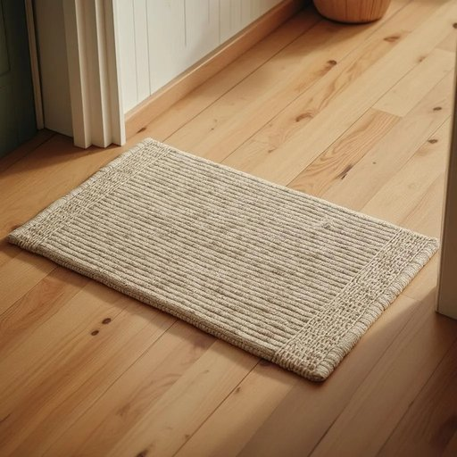

# doormat

<h1 style="font-size: 2.5em; font-weight: 300; letter-spacing: 2px; margin: 0; color: #2c3e50;">
/ˈdɔrˌmæt/
</h1>

---

---

## 例句

Before stepping inside, please make sure to wipe your shoes thoroughly on the doormat, which not only helps keep the hallway clean but also prevents mud and dirt from being tracked across the polished wooden floors, especially after the heavy rain we had this morning.

*Before(/ˌbiˈfɔr/) stepping(/ˈstɛpɪŋ/) inside,(/ˌɪnˈsaɪd,/) please(/pliz/) make(/meɪk/) sure(/ʃʊr/) to(/tɪ/) wipe(/waɪp/) your(/jʊr/) shoes(/ʃuz/) thoroughly(/ˈθəroʊli/) on(/ɔn/) the(/ðə/) doormat,(/ˈdɔrˌmæt,/) which(/wɪʧ/) not(/nɑt/) only(/ˈoʊnli/) helps(/hɛlps/) keep(/kip/) the(/ðə/) hallway(/ˈhɔlˌweɪ/) clean(/klin/) but(/bət/) also(/ˈɔlsoʊ/) prevents(/prɪˈvɛnts/) mud(/məd/) and(/ənd/) dirt(/dərt/) from(/frəm/) being(/biɪŋ/) tracked(/trækt/) across(/əˈkrɔs/) the(/ðə/) polished(/ˈpɑlɪʃt/) wooden(/ˈwʊdən/) floors,(/flɔrz,/) especially(/əˈspɛʃəli/) after(/ˈæftər/) the(/ðə/) heavy(/ˈhɛvi/) rain(/reɪn/) we(/wi/) had(/hæd/) this(/ðɪs/) morning.(/ˈmɔrnɪŋ./)*

**翻译：** 在进入室内之前，请务必在门垫上将鞋底彻底擦干净，这不仅有助于保持走廊的整洁，还能防止泥土和污渍被带入光洁的木地板，尤其是在我们今晨经历过的大雨之后。

---

## 解释

单词“doormat”在家居生活用品的语境中作为名词，指的是放置在门口用来擦脚的垫子，通常材料为橡胶、布料或草编，主要功能是防止灰尘和泥土带入室内，使用场合通常是家庭、办公室或商店的门前。在使用时，英语学习者应注意“doormat”多用作可数名词，复数形式为“doormats”，搭配时常见表达有“welcome doormat”（欢迎门垫）或“rubber doormat”（橡胶门垫），此外，“doormat”也可用作比喻，表示“任人欺负的人”，但在家居用品语境中应避免这种隐喻。其词源起自“door”（门）和“mat”（垫子）的组合，直译即门口的垫子，体现了该物品的实用性质。在中文语境中，“doormat”准确翻译为“门垫”或“门口垫”，强调其用于门前的功能性用品；应避免混淆词义，尤其区分其常用的实物指代与隐喻用法。需要注意的是，这个词在家居用品语境中无褒贬色彩，纯属中性词汇，而在比喻用法中带有贬义，表示某人性格软弱或被他人利用。总之，学习时应结合具体语境，明确其作为家居用品时的实指意义及语法用法。

---

<small style="color: #999; font-size: 0.9em;">2025-07-27 09:14:04</small>

