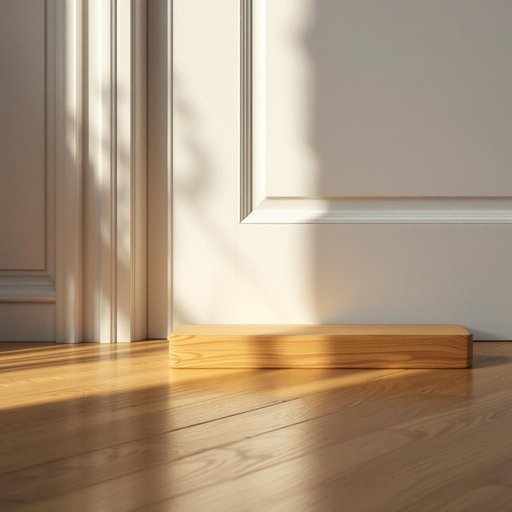

# doorstop

<h1 style="font-size: 2.5em; font-weight: 300; letter-spacing: 2px; margin: 0; color: #2c3e50;">
/doorstop*/
</h1>

---

---

## 例句

I had to find a heavy doorstop, which not only prevented the draught from sneaking in under the living room door but also kept the curious cat from barging into the kitchen while I was trying to prepare dinner.

*I(/aɪ/) had(/hæd/) to(/tɪ/) find(/faɪnd/) a(/ə/) heavy(/ˈhɛvi/) doorstop,(/doorstop*,/) which(/wɪʧ/) not(/nɑt/) only(/ˈoʊnli/) prevented(/prɪˈvɛnɪd/) the(/ðə/) draught(/dræft/) from(/frəm/) sneaking(/sˈnikɪŋ/) in(/ɪn/) under(/ˈəndər/) the(/ðə/) living(/ˈlɪvɪŋ/) room(/rum/) door(/dɔr/) but(/bət/) also(/ˈɔlsoʊ/) kept(/kɛpt/) the(/ðə/) curious(/ˈkjʊriəs/) cat(/kæt/) from(/frəm/) barging(/ˈbɑrʤɪŋ/) into(/ˈɪntu/) the(/ðə/) kitchen(/ˈkɪʧən/) while(/waɪl/) I(/aɪ/) was(/wɑz/) trying(/traɪɪŋ/) to(/tɪ/) prepare(/priˈpɛr/) dinner.(/ˈdɪnər./)*

**翻译：** 我不得不找一个沉重的门挡，不仅阻止了客厅门下的冷风偷偷溜进来，还防止了好奇的猫在我准备晚饭时闯进厨房。

---

## 解释

“doorstop”作为名词在家居生活用品场景中指的是用来固定门的位置，防止门随风关闭或移动的小物件，通常放置在门下或门侧，具体使用场合多见于需要保持门敞开或防止门夹人的情形，比如通风、搬运物品时保持通畅，或避免宠物关门意外，英语学习者使用时要注意，“doorstop”常作单数或复数形式（doorstops），且多作为可数名词出现，常见搭配有“doorstop wedge”（门楔）、“use a doorstop to hold the door open”（用门挡固定门开着）等表达，学习者还应区别其与动词短语“stop the door”不同的用法，词源上，“doorstop”由“door”（门）和“stop”（阻止）结合而成，直观表达其功能——阻止门关闭，是英语中合成词的典型例子，中文中一般译为“门档”或“门挡”，强调其物理阻挡门的作用，准确理解应避免引申或比喻义，该词在日常生活中中性无褒贬色彩，也不含特殊文化内涵，主要是一种实用工具的称谓，总之，doorstop在家居语境中是一种简洁明了、功能明确的实用名词，学习时需掌握其具体用途和常见搭配以正确表达和理解。

---

<small style="color: #999; font-size: 0.9em;">2025-07-27 09:14:04</small>

