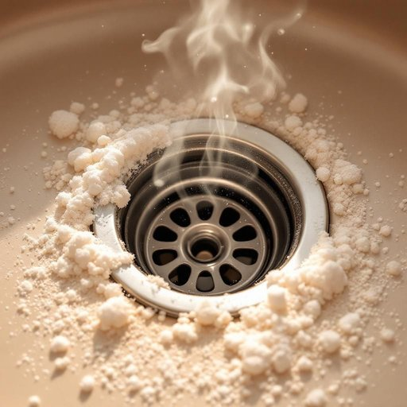

# drain

<h1 style="font-size: 2.5em; font-weight: 300; letter-spacing: 2px; margin: 0; color: #2c3e50;">
/dreɪn/
</h1>

---

---

## 例句

I noticed that the kitchen sink was draining unusually slowly, so I decided to remove the drain cover, which was clogged with a mixture of soap residue and food particles, before using a combination of boiling water and baking soda to clear the blockage, hoping it would prevent any unpleasant smells from developing.

*I(/aɪ/) noticed(/ˈnoʊtɪst/) that(/ðət/) the(/ðə/) kitchen(/ˈkɪʧən/) sink(/sɪŋk/) was(/wɑz/) draining(/ˈdreɪnɪŋ/) unusually(/ənˈjuˌʒuəli/) slowly,(/sˈloʊli,/) so(/soʊ/) I(/aɪ/) decided(/ˌdɪˈsaɪdɪd/) to(/tɪ/) remove(/riˈmuv/) the(/ðə/) drain(/dreɪn/) cover,(/ˈkəvər,/) which(/wɪʧ/) was(/wɑz/) clogged(/klɔgd/) with(/wɪθ/) a(/ə/) mixture(/ˈmɪksʧər/) of(/əv/) soap(/soʊp/) residue(/ˈrɛzəˌdu/) and(/ənd/) food(/fud/) particles,(/ˈpɑrtɪkəlz,/) before(/ˌbiˈfɔr/) using(/ˈjuzɪŋ/) a(/ə/) combination(/ˌkɑmbəˈneɪʃən/) of(/əv/) boiling(/ˈbɔɪlɪŋ/) water(/ˈwɔtər/) and(/ənd/) baking(/ˈbeɪkɪŋ/) soda(/ˈsoʊdə/) to(/tɪ/) clear(/klɪr/) the(/ðə/) blockage,(/ˈblɑkɪʤ,/) hoping(/ˈhoʊpɪŋ/) it(/ɪt/) would(/wʊd/) prevent(/prɪˈvɛnt/) any(/ˈɛni/) unpleasant(/ənˈplɛzənt/) smells(/smɛlz/) from(/frəm/) developing.(/dɪˈvɛləpɪŋ./)*

**翻译：** 我注意到厨房水槽排水异常缓慢，于是决定先取下排水盖，发现其中堵塞着肥皂残渣和食物碎屑的混合物，随后使用沸水和小苏打相结合的方法来疏通堵塞，希望这样能防止产生异味。

---

## 解释

在家居生活用品的语境中，英语单词“drain”作为名词通常指排水口、下水道、排水管或排水设施，常见于厨房水槽、浴室洗手盆或地面等处，用于排出使用后的水或废液。具体使用场合如描写家庭装修、卫浴设备或清洁维护时，讲述“the sink drain”意为“水槽的排水管”或“浴室的排水口”等。英语学习者在使用时应注意，“drain”作为名词常与“sink”、“bathtub”、“floor”等搭配，如“drain pipe”、“drain cover”等。此外，“drain”也可以用作动词，意指“排干、流走”，但作为名词时侧重指具体的排水设施。从语法角度，“drain”作为可数名词时，可用复数形式“drains”，表示多个排水口或排水系统。词源上，“drain”源自古法语“drain”意为“沟渠、排水沟”，进而演变为表示排水装置的词汇，在中世纪英语中开始固定指排水设施。中文语境中，“drain”多译为“排水口”或“下水道”，强调其排放功能，准确理解时应区别于广义的“水管”（pipe）或“水槽”（sink），避免泛化。总体来看，该词在家居场景下中性无褒贬色彩，更多体现实用性和功能性，是描述生活环境基础设施的重要词汇。

---

<small style="color: #999; font-size: 0.9em;">2025-07-27 09:14:04</small>

