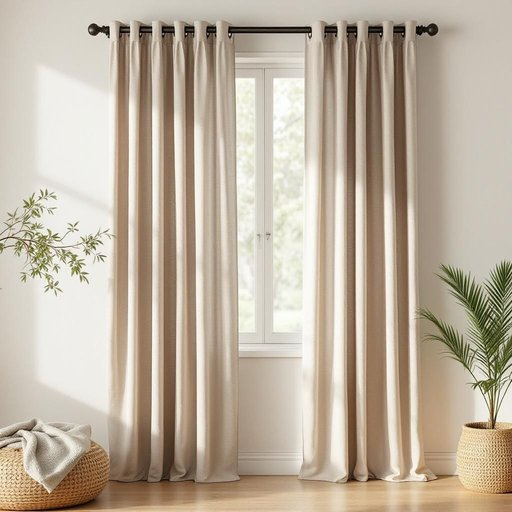

# drape

<h1 style="font-size: 2.5em; font-weight: 300; letter-spacing: 2px; margin: 0; color: #2c3e50;">
/dreɪp/
</h1>

---

---

## 例句

The intricate tapestry, a masterpiece that the artisan wove with countless hours of dedication, serves as both a historical record and a magnificent display of cultural heritage in the ancient museum.

*The(/ðə/) intricate(/ˈɪntrəkət/) tapestry,(/ˈtæpəstri,/) a(/ə/) masterpiece(/ˈmæstərˌpis/) that(/ðət/) the(/ðə/) artisan(/ˈɑrtəzən/) wove(/woʊv/) with(/wɪθ/) countless(/ˈkaʊntləs/) hours(/aʊərz/) of(/əv/) dedication,(/ˌdɛdəˈkeɪʃən,/) serves(/sərvz/) as(/ɛz/) both(/boʊθ/) a(/ə/) historical(/hɪˈstɔrɪkəl/) record(/ˈrɛkərd/) and(/ənd/) a(/ə/) magnificent(/mægˈnɪfɪsənt/) display(/dɪˈspleɪ/) of(/əv/) cultural(/ˈkəlʧərəl/) heritage(/ˈhɛrɪtɪʤ/) in(/ɪn/) the(/ðə/) ancient(/ˈeɪnʧənt/) museum.(/mˈjuziəm./)*

**翻译：** 这幅错综复杂的挂毯，是工匠倾注无数心血编织而成的杰作，既是历史的见证，也是古老博物馆中文化遗产的壮丽展示。

---

## 解释

英语单词“drape”作为名词在家居生活用品场景中，主要指用来悬挂或覆盖窗户、家具等的厚重布料，即“窗帘”或“帷幔”。具体使用场合多见于描述室内装饰时，如说“living room drapes”（客厅窗帘）或“heavy velvet drapes”（厚重的天鹅绒帷幔），常用来强调功能性与装饰性的结合。语法上，“drape”作为名词通常是可数名词，常与形容词搭配使用，如“sheer drapes”（薄纱窗帘）、“patterned drapes”（有图案的窗帘），且在句中多用作主语、宾语或后置定语，“the drapes in this room are beautiful”是典型表达。此外，drape常与动词“hang”连用形成表达“hang the drapes”，即“挂窗帘”。学习者需注意“drape”既可作名词也可作动词，二者语义关联但用法不同。词源方面，“drape”源自中古法语“drap”，意为布料，进一步来自拉丁语“drappus”，指柔软织物，这反映了该词与布料及其悬挂状态的本质关系。在中文语境中，“drape”作为名词通常准确翻译为“窗帘”或“帷幔”，强调布料的垂挂感及装饰功能，无明显褒贬含义，但常用来体现居家环境的温馨、典雅或豪华氛围。需要注意的是，在美式英语中“drapes”比“curtains”常用且稍显正式，而后者语感更普遍和中性。综上，“drape”作为名词在家居环境里主要指装饰性且功能性的布质窗帘，是室内设计的重要元素之一。

---

<small style="color: #999; font-size: 0.9em;">2025-07-27 09:14:04</small>

