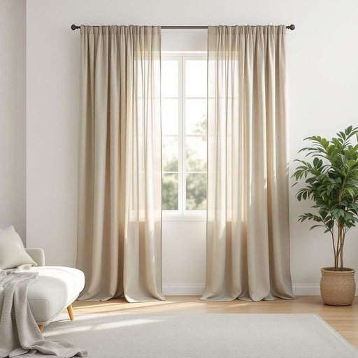

# drapery

<h1 style="font-size: 2.5em; font-weight: 300; letter-spacing: 2px; margin: 0; color: #2c3e50;">
/ˈdreɪpəri/
</h1>

---

---

## 例句

The drapery in the living room, which was expertly tailored from heavy velvet to both insulate against the chilly drafts and add a touch of Victorian elegance, completely transformed the atmosphere, making the space feel far more inviting and cosy than it did before.

*The(/ðə/) drapery(/ˈdreɪpəri/) in(/ɪn/) the(/ðə/) living(/ˈlɪvɪŋ/) room,(/rum,/) which(/wɪʧ/) was(/wɑz/) expertly(/ˈɛkspərtli/) tailored(/ˈteɪlərd/) from(/frəm/) heavy(/ˈhɛvi/) velvet(/ˈvɛlvət/) to(/tɪ/) both(/boʊθ/) insulate(/ˈɪnsəˌleɪt/) against(/əˈgɛnst/) the(/ðə/) chilly(/ˈʧɪli/) drafts(/dræfts/) and(/ənd/) add(/æd/) a(/ə/) touch(/təʧ/) of(/əv/) Victorian(/vɪkˈtɔriən/) elegance,(/ˈɛləgəns,/) completely(/kəmˈplitli/) transformed(/trænsˈfɔrmd/) the(/ðə/) atmosphere,(/ˈætməsˌfɪr,/) making(/ˈmeɪkɪŋ/) the(/ðə/) space(/speɪs/) feel(/fil/) far(/fɑr/) more(/mɔr/) inviting(/ˌɪnˈvaɪtɪŋ/) and(/ənd/) cosy(/ˈkoʊzi/) than(/ðən/) it(/ɪt/) did(/dɪd/) before.(/ˌbiˈfɔr./)*

**翻译：** 客厅里的窗帘采用厚重的天鹅绒精心裁制，既能抵御寒冷的气流，又增添一抹维多利亚式的优雅感，彻底改变了整个氛围，让空间比以前更加温馨宜人。

---

## 解释

英语单词“drapery”作为名词，在家居生活用品的语境中主要指的是用于装饰和遮挡窗户或家具的布料，通常包括厚重的窗帘或帷幔，强调其布料的质地和悬挂方式。具体使用场合多见于描述室内装饰环境，如谈论客厅、卧室或剧院中用来营造某种氛围的布艺装饰品时。英语学习者使用该词时需注意“drapery”通常不可数，指布料的整体或一类装饰布，而不是具体的单个窗帘；常见搭配包括“heavy drapery”（厚重窗帘）、“elegant drapery”（优雅的悬挂布）或“theater drapery”（剧院幕布），表达时可用作复合名词或整体名词，且多用单数形式。词源上，“drapery”源自中世纪法语“draperie”，而“drap”源自拉丁语“drappus”，意为布料或布块，反映了其起初指布匹、布料的本义，后来引申为具有悬挂和装饰功能的布艺。中文语境中，该词通常译为“窗帘”、“帷幔”或“悬挂的装饰布”，强调其既有实用遮光功能又有装饰价值，常含有一定的奢华或精致感，属于室内装饰的重要组成部分，无明显褒贬含义，文化上体现了对空间美感和私密性的重视。

---

<small style="color: #999; font-size: 0.9em;">2025-07-27 09:14:04</small>

