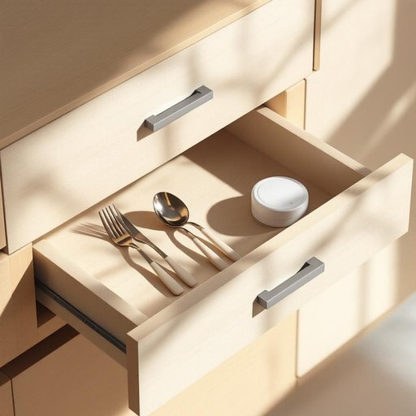

# drawer

<h1 style="font-size: 2.5em; font-weight: 300; letter-spacing: 2px; margin: 0; color: #2c3e50;">
/drɔr/
</h1>

---

---

## 例句

Could you please check the top drawer in the kitchen cabinet, where we usually keep the cutlery and those spare batteries, just in case we need them for the remote controls or the smoke alarm?

*Could(/kʊd/) you(/ju/) please(/pliz/) check(/ʧɛk/) the(/ðə/) top(/tɔp/) drawer(/drɔr/) in(/ɪn/) the(/ðə/) kitchen(/ˈkɪʧən/) cabinet,(/ˈkæbənət,/) where(/wɛr/) we(/wi/) usually(/ˈjuʒəwəli/) keep(/kip/) the(/ðə/) cutlery(/ˈkətləri/) and(/ənd/) those(/ðoʊz/) spare(/spɛr/) batteries,(/ˈbætəriz,/) just(/ʤɪst/) in(/ɪn/) case(/keɪs/) we(/wi/) need(/nid/) them(/ðɛm/) for(/fər/) the(/ðə/) remote(/rɪˈmoʊt/) controls(/kənˈtroʊlz/) or(/ər/) the(/ðə/) smoke(/smoʊk/) alarm?(/əˈlɑrm?/)*

**翻译：** 请您帮忙查看一下厨房橱柜的最上层抽屉，我们通常会把餐具和备用电池放在那里，以备需要给遥控器或烟雾报警器更换电池时使用。

---

## 解释

英语单词“drawer”在家居生活用品语境中作为名词，主要指家具中可拉出的抽屉，用于存放各种物品，如衣物、文具、餐具等。具体使用场合通常是在描述家具结构或安排物品收纳时，例如“The kitchen has three drawers for utensils”（厨房有三个抽屉用来放餐具）。英语学习者在使用该词时需注意，“drawer”作为名词常搭配“open/close a drawer”（打开/关闭抽屉）、“a drawer handle”（抽屉拉手）、“a drawer unit”（带抽屉的家具单元）等表达，且不可混淆动词“draw”与名词“drawer”的发音和含义。词源方面，“drawer”源自古英语“dragan”意为“拉，拖”，后衍生为表示可被拉出的部件，反映了其功能属性。在中文语境中，“drawer”准确定义为“抽屉”，是家居生活中常见的收纳结构，并无褒义或贬义色彩，是一个中性且实用的名词。总体来看，其使用简洁明了，形象直观，是描述家具构件时不可或缺的词汇。

---

<small style="color: #999; font-size: 0.9em;">2025-07-27 09:14:04</small>

