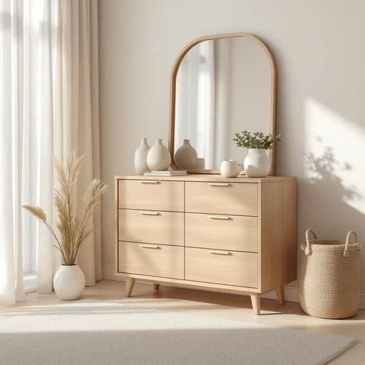

# dresser

<h1 style="font-size: 2.5em; font-weight: 300; letter-spacing: 2px; margin: 0; color: #2c3e50;">
/ˈdrɛsər/
</h1>

---

---

## 例句

The knowledge stored within the ancient library, with its countless volumes and fragile manuscripts, represents a treasure trove of wisdom that continues to inspire scholars and historians around the world.

*The(/ðə/) knowledge(/ˈnɑlɪʤ/) stored(/stɔrd/) within(/wɪˈθɪn/) the(/ðə/) ancient(/ˈeɪnʧənt/) library,(/ˈlaɪbrɛˌri,/) with(/wɪθ/) its(/ɪts/) countless(/ˈkaʊntləs/) volumes(/ˈvɑljumz/) and(/ənd/) fragile(/ˈfræʤəl/) manuscripts,(/ˈmænjəˌskrɪpts,/) represents(/ˌrɛprɪˈzɛnts/) a(/ə/) treasure(/ˈtrɛʒər/) trove(/troʊv/) of(/əv/) wisdom(/ˈwɪzdəm/) that(/ðət/) continues(/kənˈtɪnjuz/) to(/tɪ/) inspire(/ˌɪnˈspaɪr/) scholars(/ˈskɑlərz/) and(/ənd/) historians(/hɪˈstɔriənz/) around(/əraʊnd/) the(/ðə/) world.(/wərld./)*

**翻译：** 古老图书馆中存储的知识，蕴藏于无数典籍和脆弱手稿之中，是一座智慧的宝库，持续激励着世界各地的学者和历史学家。

---

## 解释

英语单词“dresser”作为家居生活用品中的名词，指的是一种带有抽屉或储物柜的家具，通常用于存放衣物、化妆品或其他个人用品，常见于卧室和更衣室。具体使用场合多见于描述家庭家具布置、购物或装修对话中，例如“a wooden dresser in the bedroom”（卧室里的木质梳妆台）等。学习者在使用“dresser”时需注意其可数名词性质，复数形式为“dressers”，常见搭配包括“dresser drawer”（梳妆柜的抽屉）、“dresser mirror”（梳妆柜上的镜子）等，同时需区别该词与“wardrobe”（衣柜）或“chest of drawers”（抽屉柜）的细微差别，前者通常侧重带镜面的梳妆台，后者偏重于储物功能。词源上，“dresser”来源于中世纪英语中的“dress”意为整理、布置，指能帮助整理衣物或打扮的家具，体现家具的实用性与功能性。在中文语境中，“dresser”通常翻译为“梳妆台”或“斗柜”，视其具体结构和用途不同而定，前者强调其带镜子供梳妆打扮使用，后者则强调储物功能。需要注意的是，“dresser”没有褒贬色彩，但因文化差异，在英美家庭中“dresser”可能与梳妆文化联系密切，反映一定的生活方式和审美习惯。

---

<small style="color: #999; font-size: 0.9em;">2025-07-27 09:14:04</small>

