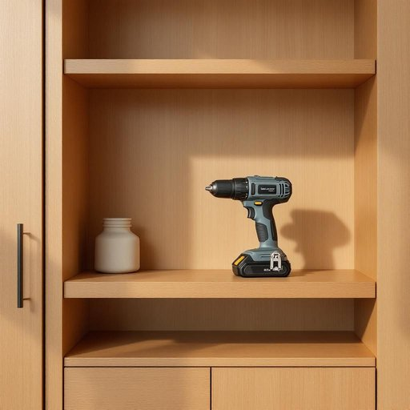

# drill

<h1 style="font-size: 2.5em; font-weight: 300; letter-spacing: 2px; margin: 0; color: #2c3e50;">
/drɪl/
</h1>

---

---

## 例句

Could you please hand me the cordless drill that’s tucked away in the garage cabinet, the one with the interchangeable bits and the rechargeable battery, because I need to fix the loose shelf brackets in the living room before our guests arrive this evening?

*Could(/kʊd/) you(/ju/) please(/pliz/) hand(/hænd/) me(/mi/) the(/ðə/) cordless(/ˈkɔrdləs/) drill(/drɪl/) that’s(/that’s*/) tucked(/təkt/) away(/əˈweɪ/) in(/ɪn/) the(/ðə/) garage(/gərɑʒ/) cabinet,(/ˈkæbənət,/) the(/ðə/) one(/wən/) with(/wɪθ/) the(/ðə/) interchangeable(/ˌɪnərˈʧeɪnʤəbəl/) bits(/bɪts/) and(/ənd/) the(/ðə/) rechargeable(/riˈʧɑrʤəbəl/) battery,(/ˈbætəri,/) because(/bɪˈkəz/) I(/aɪ/) need(/nid/) to(/tɪ/) fix(/fɪks/) the(/ðə/) loose(/lus/) shelf(/ʃɛlf/) brackets(/ˈbrækɪts/) in(/ɪn/) the(/ðə/) living(/ˈlɪvɪŋ/) room(/rum/) before(/ˌbiˈfɔr/) our(/ɑr/) guests(/gɛsts/) arrive(/əraɪv/) this(/ðɪs/) evening?(/ˈivnɪŋ?/)*

**翻译：** 请你帮我把车库柜子里那个带可更换钻头和可充电电池的无线电钻递给我好吗？因为我需要在今晚客人到来之前把客厅里松动的搁板支架修好。

---

## 解释

英语单词“drill”作为名词在家居生活用品场景中通常指的是电钻或手钻，是一种用于钻孔或安装的工具，广泛应用于墙壁、家具等材料上打孔、拧螺丝等修理和装修工作中。使用时常见的搭配包括“electric drill”（电动钻）、“cordless drill”（无线电钻）和“power drill”（电动工具），英语学习者应注意其单数和复数形式“drills”，以及在不同语境下“drill”作为名词和动词有不同含义，前者指工具，后者指训练或反复练习，避免混淆。此外，“drill”可与介词短语连用，如“a drill for wood”（用来钻木头的钻头）或“a drill on the wall”（在墙上的钻孔）。该词源于中古英语“drillen”，传统意义上指连续钻孔或磨削动作，其拉丁语根源可追溯至“terere”（磨碎、擦），体现了其打磨、穿透的功能。中文语境中，“drill”作为家居生活用品名词最准确的翻译是“钻头”或“电钻”，具体依工具类型而定，不宜直接泛译为“钻”以免混淆工具动作与名称。总体而言，“drill”本身无明显的褒贬色彩，是一种中性且功能性的工具名词，因应用广泛而文化内涵简单直接，主要强调其实用性和技术属性。

---

<small style="color: #999; font-size: 0.9em;">2025-07-27 09:14:04</small>

