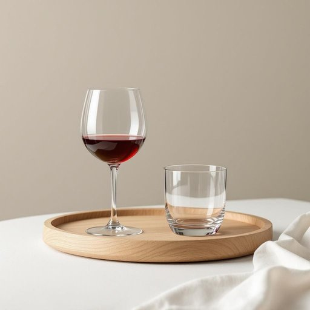

# drinkware

<h1 style="font-size: 2.5em; font-weight: 300; letter-spacing: 2px; margin: 0; color: #2c3e50;">
/drinkware*/
</h1>

---

---

## 例句

After we finished unpacking the kitchen boxes, I realized that the drinkware, including several delicate wine glasses and sturdy tumblers, hadn’t been properly wrapped, which made me worry they might have been damaged during the move.

*After(/ˈæftər/) we(/wi/) finished(/ˈfɪnɪʃt/) unpacking(/ənˈpækɪŋ/) the(/ðə/) kitchen(/ˈkɪʧən/) boxes,(/ˈbɑksɪz,/) I(/aɪ/) realized(/ˈriəˌlaɪzd/) that(/ðət/) the(/ðə/) drinkware,(/drinkware*,/) including(/ˌɪnˈkludɪŋ/) several(/ˈsɛvərəl/) delicate(/ˈdɛləkət/) wine(/waɪn/) glasses(/ˈglæsɪz/) and(/ənd/) sturdy(/ˈstərdi/) tumblers,(/ˈtəmblərz,/) hadn’t(/hadn’t*/) been(/bɪn/) properly(/ˈprɑpərli/) wrapped,(/ræpt,/) which(/wɪʧ/) made(/meɪd/) me(/mi/) worry(/ˈwəri/) they(/ðeɪ/) might(/maɪt/) have(/hæv/) been(/bɪn/) damaged(/ˈdæmɪʤd/) during(/ˈdʊrɪŋ/) the(/ðə/) move.(/muv./)*

**翻译：** 我们拆完厨房的箱子后，我才意识到饮具——包括几只精致的红酒杯和结实的水杯——没有被妥善包裹，这让我担心它们在搬运过程中可能受到了损坏。

---

## 解释

“drinkware”作为名词，指的是用于盛装饮料的各类容器，典型包括杯子、玻璃杯、马克杯、酒杯、水瓶等，常见于家居生活用品环境中，尤其涉及厨房、餐厅或宴会场合。当英语学习者使用该词时需注意其不可数名词性质，通常用作集合名词，表示一类饮具而非单个具体物品，因此在搭配时多见复数形式或以整体称谓出现，如“drinkware sets”表示饮具套装。此外，“drinkware”常与形容词搭配，如“glass drinkware”（玻璃制饮具）或“ceramic drinkware”（陶瓷饮具），亦可与特定场合或功能性词汇结合，如“casual drinkware”（日常饮具）、“outdoor drinkware”（户外饮具）。词源上，“drinkware”由“drink”（喝，饮料）和后缀“-ware”（器具）构成，属合成词，强调饮用这一使用目的。中文语境中，“drinkware”准确翻译为“饮具”或“饮杯”，强调的是用于盛放饮品的容器，区别于餐具（cutlery）或厨具，且具较中性、实用性质，无明显褒贬或特定文化内涵，普遍用于家居、餐饮相关描述，便于表达饮用容器的类别和功能。

---

<small style="color: #999; font-size: 0.9em;">2025-07-27 09:14:04</small>

