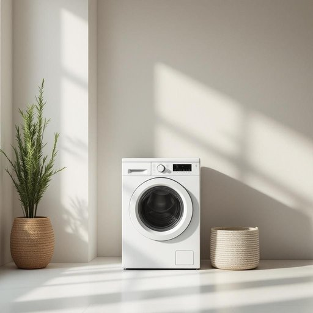

# dryer

<h1 style="font-size: 2.5em; font-weight: 300; letter-spacing: 2px; margin: 0; color: #2c3e50;">
/draɪər/
</h1>

---

---

## 例句

After finishing the laundry, I realised that the dryer, which usually works quietly in the corner, was making a strange noise that I hadn’t heard before, so I decided to check the filter and the vent thoroughly to prevent any potential damage or fire hazard.

*After(/ˈæftər/) finishing(/ˈfɪnɪʃɪŋ/) the(/ðə/) laundry,(/ˈlɔndri,/) I(/aɪ/) realised(/ˈriəˌlaɪzd/) that(/ðət/) the(/ðə/) dryer,(/draɪər,/) which(/wɪʧ/) usually(/ˈjuʒəwəli/) works(/wərks/) quietly(/kˈwaɪətli/) in(/ɪn/) the(/ðə/) corner,(/ˈkɔrnər,/) was(/wɑz/) making(/ˈmeɪkɪŋ/) a(/ə/) strange(/streɪnʤ/) noise(/nɔɪz/) that(/ðət/) I(/aɪ/) hadn’t(/hadn’t*/) heard(/hərd/) before,(/ˌbiˈfɔr,/) so(/soʊ/) I(/aɪ/) decided(/ˌdɪˈsaɪdɪd/) to(/tɪ/) check(/ʧɛk/) the(/ðə/) filter(/ˈfɪltər/) and(/ənd/) the(/ðə/) vent(/vɛnt/) thoroughly(/ˈθəroʊli/) to(/tɪ/) prevent(/prɪˈvɛnt/) any(/ˈɛni/) potential(/pəˈtɛnʃəl/) damage(/ˈdæmɪʤ/) or(/ər/) fire(/faɪər/) hazard.(/ˈhæzərd./)*

**翻译：** 洗完衣服后，我发现平时安静地待在角落里的烘干机发出了一种我从未听过的奇怪声音，于是我决定仔细检查滤网和排气口，以防止任何潜在的损害或火灾隐患。

---

## 解释

英语单词“dryer”在家居生活用品场景中作为名词，主要指用于去除衣物、头发或其他物品中水分的设备或工具，比如“clothes dryer”（烘干机）或“hair dryer”（吹风机）。具体使用时，常见于家庭洗衣间、浴室或美容场所，描述帮助快速干燥的机器或装置。英语学习者需注意“dryer”作为可数名词，复数形式为“dryers”，且通常用定冠词或指示代词与其搭配，如“the dryer”或“this dryer”；同时常与“clothes”、“hair”等名词连用形成复合名词，表达更具体的种类。词源方面，“dryer”来自动词“dry”加上表示“执行者”或“工具”的后缀“-er”，意指“使某物变干的装置或人”。在中文语境中，“dryer”准确译为“烘干机”或“吹风机”，根据具体种类区别对待，含义明确且无褒贬色彩，属于中性词汇。总体而言，使用时需结合具体情境辨别指代对象，避免误解，如“dryer”单独出现多半指烘干机，强调家用电器功能，是生活中常见且实用的词汇。

---

<small style="color: #999; font-size: 0.9em;">2025-07-27 09:14:04</small>

