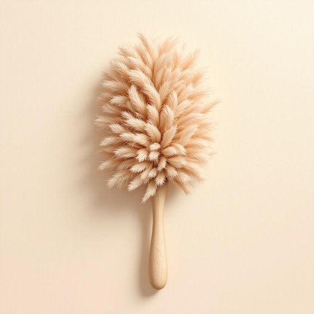

# duster

<h1 style="font-size: 2.5em; font-weight: 300; letter-spacing: 2px; margin: 0; color: #2c3e50;">
/ˈdəstər/
</h1>

---

---

## 例句

Before the meeting began, the chairman's decision to delay the project caused a significant shift in the boardroom's atmosphere, sparking intense discussions about the company's future strategy.

*Before(/ˌbiˈfɔr/) the(/ðə/) meeting(/ˈmitɪŋ/) began,(/bɪˈgæn,/) the(/ðə/) chairman's(/ˈʧɛrmənz/) decision(/dɪˈsɪʒən/) to(/tɪ/) delay(/dɪˈleɪ/) the(/ðə/) project(/ˈprɑʤɛkt/) caused(/kɔzd/) a(/ə/) significant(/sɪgˈnɪfɪkənt/) shift(/ʃɪft/) in(/ɪn/) the(/ðə/) boardroom's(/boardroom's*/) atmosphere,(/ˈætməsˌfɪr,/) sparking(/ˈspɑrkɪŋ/) intense(/ˌɪnˈtɛns/) discussions(/dɪˈskəʃənz/) about(/əˈbaʊt/) the(/ðə/) company's(/ˈkəmpəniz/) future(/fˈjuʧər/) strategy.(/ˈstrætəʤi./)*

**翻译：** 会议开始前，主席决定推迟项目，这一决定使董事会的氛围发生了显著变化，激发了围绕公司未来战略的激烈讨论。

---

## 解释

英语单词"duster"在家居生活用品语境中作为名词，通常指用于清洁灰尘的工具，即“掸子”或“除尘器”，常见的形态包括羽毛掸子、纤维刷或布制的擦拭器，适用于家具、陈设品或电子设备表面等的日常除尘。具体使用场合多见于家庭清洁、保洁服务或家政描述中，话语环境通常涉及打扫卫生或保持室内整洁。英语学习者在使用"duster"时需注意，它只能指除尘工具而非指代其他清洁用具如拖把或扫帚，且其复数形式为"dusters"。常见搭配包括“feather duster”、“dusting with a duster”或“use a duster to clean”，表达时多用作可数名词。词源方面，"duster"源自动词"dust"（掸去灰尘），后加名词后缀“-er”，表示执行除尘动作的工具或人；最早见于十九世纪末，反映出工业化后居家清洁工具的普及与命名习惯。在中文语境中，"duster"准确译为“掸子”或“掸灰刷”，强调其除尘功能，不宜混淆为其他清洁器具。该词一般无褒贬色彩，属中性词汇，但在某些文化背景下，因使用的材质和形态不同，可能传达出使用场合的正式度或家庭经济情况。总之，"duster"在家居生活中是一种非常实用且具体的清洁工具名词，词义明确且具有较强的功能指向性。

---

<small style="color: #999; font-size: 0.9em;">2025-07-27 09:14:04</small>

