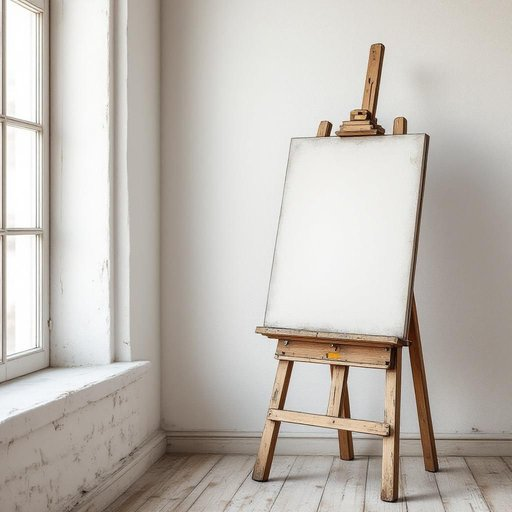

# easel

<h1 style="font-size: 2.5em; font-weight: 300; letter-spacing: 2px; margin: 0; color: #2c3e50;">
/ˈizəl/
</h1>

---

---

## 例句

While tidying up the living room, I found the old wooden easel tucked away behind the bookshelf, its paint-splattered surface reminding me of the countless afternoons spent painting landscapes and portraits, and I thought it would be lovely to set it up near the window, where natural light floods in, so that I could finally resume my long-neglected hobby.

*While(/waɪl/) tidying(/tidying*/) up(/əp/) the(/ðə/) living(/ˈlɪvɪŋ/) room,(/rum,/) I(/aɪ/) found(/faʊnd/) the(/ðə/) old(/oʊld/) wooden(/ˈwʊdən/) easel(/ˈizəl/) tucked(/təkt/) away(/əˈweɪ/) behind(/bɪˈhaɪnd/) the(/ðə/) bookshelf,(/ˈbʊkˌʃɛlf,/) its(/ɪts/) paint-splattered(/paint-splattered*/) surface(/ˈsərfəs/) reminding(/riˈmaɪndɪŋ/) me(/mi/) of(/əv/) the(/ðə/) countless(/ˈkaʊntləs/) afternoons(/ˌæftərˈnunz/) spent(/spɛnt/) painting(/ˈpeɪnɪŋ/) landscapes(/ˈlænˌskeɪps/) and(/ənd/) portraits,(/ˈpɔrtrəts,/) and(/ənd/) I(/aɪ/) thought(/θɔt/) it(/ɪt/) would(/wʊd/) be(/bi/) lovely(/ˈləvli/) to(/tɪ/) set(/sɛt/) it(/ɪt/) up(/əp/) near(/nɪr/) the(/ðə/) window,(/ˈwɪndoʊ,/) where(/wɛr/) natural(/ˈnæʧərəl/) light(/laɪt/) floods(/flədz/) in,(/ɪn,/) so(/soʊ/) that(/ðət/) I(/aɪ/) could(/kʊd/) finally(/ˈfaɪnəli/) resume(/ˈrɛzəˌmeɪ/) my(/maɪ/) long-neglected(/long-neglected*/) hobby.(/ˈhɑbi./)*

**翻译：** 整理客厅时，我在书架后面发现了那架旧木画架。它斑驳的油漆面板让我想起了无数个下午，用画笔描绘山水和肖像的时光。我觉得把画架摆放在窗边，自然光洒满的地方，会很美好，这样我终于可以重新开始我那长久未曾触碰的爱好。

---

## 解释

英语单词'easel'作为名词，指的是一种用于支撑画布、板子或纸张的三脚架，常见于绘画和书写场合，在家居生活用品中通常指画架或展示架。具体使用场合多为艺术创作、教育培训或家庭装饰中，比如画家作画时将画布挂在easel上，学生在绘画课使用，或者在家中展示照片和海报时用作支架。英语学习者在使用该词时应注意其固定的语法定位为可数名词，常见搭配有“paint on an easel”（在画架上绘画）、“wooden easel”（木制画架）、“display on an easel”（用画架展示）等，表达时多用于描述物体放置或支撑状态，且不与动词直接构成复杂短语。词源上，easel来源于古英语“āsil”或“æslic”，原意为“驴子”或“架子”，比喻用于支撑画布或重物的工具，后来演变为现代英语中专指画架的名词。在中文语境中，easel准确翻译为“画架”，强调其用于支撑绘画用具的功能，无特别褒贬含义或文化色彩，属于中性词汇，主要用于艺术和教育领域，为描述艺术绘画工具的常用术语，便于理解为便携式支撑结构，帮助固定绘画材料。

---

<small style="color: #999; font-size: 0.9em;">2025-07-27 09:14:04</small>

