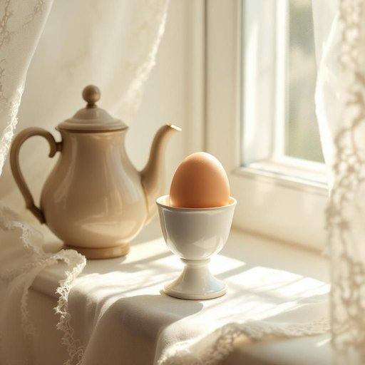

# eggcup

<h1 style="font-size: 2.5em; font-weight: 300; letter-spacing: 2px; margin: 0; color: #2c3e50;">
/ˈɛgˌkəp/
</h1>

---

---

## 例句

The eggcup on the windowsill, which caught the morning sunlight filtering through the lace curtains, perfectly complements the antique teapot that has been in our family for generations.

*The(/ðə/) eggcup(/ˈɛgˌkəp/) on(/ɔn/) the(/ðə/) windowsill,(/windowsill*,/) which(/wɪʧ/) caught(/kɔt/) the(/ðə/) morning(/ˈmɔrnɪŋ/) sunlight(/ˈsənˌlaɪt/) filtering(/ˈfɪltərɪŋ/) through(/θru/) the(/ðə/) lace(/leɪs/) curtains,(/ˈkərtənz,/) perfectly(/ˈpərfəktli/) complements(/ˈkɑmpləmənts/) the(/ðə/) antique(/ænˈtik/) teapot(/ˈtiˌpɑt/) that(/ðət/) has(/həz/) been(/bɪn/) in(/ɪn/) our(/ɑr/) family(/ˈfæməli/) for(/fər/) generations.(/ˌʤɛnərˈeɪʃənz./)*

**翻译：** 窗台上的蛋杯，沐浴着透过蕾丝窗帘洒入的晨光，与那只传承数代的古董茶壶相得益彰。

---

## 解释

英语单词“eggcup”作为名词在家居生活用品场景中指的是一种专门用来盛放煮熟鸡蛋的小杯子，通常用于早餐时将鸡蛋固定，便于食用。这种物品一般出现在餐桌上，尤其是在英美等西方国家的传统早餐文化中，比如用来盛放水煮蛋或半熟蛋，方便用勺子挖食。英语学习者在使用“eggcup”时需注意它是可数名词，常见的搭配有“一套餐具中的蛋杯”或“一只陶瓷/瓷制蛋杯”，表达时多用于实际物品的描述。语法上，作为具体物品的名词，通常用单数形式表示一只蛋杯，复数形式“eggcups”则表示多个。词源上，“eggcup”由“egg”（鸡蛋）和“cup”（杯子）组成，形成一个复合名词，直接指代盛蛋用的小杯，体现了英语构词的直观性。中文中“eggcup”准确译为“蛋杯”或“蛋座”，强调其用来盛放鸡蛋的功能，避免将其误解为普通的杯子或碗，因而在家庭厨房及餐具分类中较为明确。该词无特别褒贬或文化色彩，属日常生活用品的中性词，使用时主要关注其具体用途和搭配即可。

---

<small style="color: #999; font-size: 0.9em;">2025-07-27 09:14:04</small>

