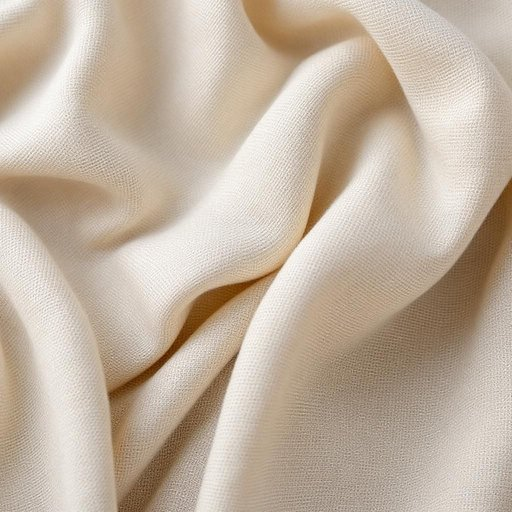

# fabric

<h1 style="font-size: 2.5em; font-weight: 300; letter-spacing: 2px; margin: 0; color: #2c3e50;">
/ˈfæbrɪk/
</h1>

---

---

## 例句

When analyzing the intricate relationship between the economy and social policies, the data reveals that the fabric of society is often woven with threads of both opportunity and inequality, which policymakers must carefully consider to create sustainable growth.

*When(/wɪn/) analyzing(/ˈænəˌlaɪzɪŋ/) the(/ðə/) intricate(/ˈɪntrəkət/) relationship(/riˈleɪʃənˌʃɪp/) between(/bɪtˈwin/) the(/ðə/) economy(/ɪˈkɑnəmi/) and(/ənd/) social(/ˈsoʊʃəl/) policies,(/ˈpɑləsiz,/) the(/ðə/) data(/ˈdætə/) reveals(/rɪˈvilz/) that(/ðət/) the(/ðə/) fabric(/ˈfæbrɪk/) of(/əv/) society(/soʊˈsaɪɪti/) is(/ɪz/) often(/ˈɔfən/) woven(/ˈwoʊvən/) with(/wɪθ/) threads(/θrɛdz/) of(/əv/) both(/boʊθ/) opportunity(/ˌɑpərˈtunəti/) and(/ənd/) inequality,(/ˌɪnɪkˈwɑləti,/) which(/wɪʧ/) policymakers(/ˈpɑləsiˌmeɪkərz/) must(/məst/) carefully(/ˈkɛrfəli/) consider(/kənˈsɪdər/) to(/tɪ/) create(/kriˈeɪt/) sustainable(/səˈsteɪnəbəl/) growth.(/groʊθ./)*

**翻译：** 在分析经济与社会政策之间错综复杂的关系时，数据表明，社会结构往往由机遇与不平等的双重线索交织而成，政策制定者必须审慎考量，以实现可持续发展。

---

## 解释

英语单词“fabric”在家居生活用品场景中作为名词，主要指用于制作衣物、窗帘、沙发套、床单等家纺产品的织物或布料，常见于描述家居装饰材料的语境，如“fabric sofa”（布艺沙发）、“curtain fabric”（窗帘布料）等。使用时，英语学习者应注意其不可数名词的用法，但在指各种布料种类时也可作可数名词，常见搭配有“fabric pattern”（布料图案）、“fabric texture”（织物质地）、“fabric color”（布料颜色）等，此外，“fabric softener”（织物柔顺剂）等短语中“fabric”表织物整体概念，体现了词的应用多样性。词源方面，“fabric”源自拉丁语“fabricare”，意为“制造、构造”，引申为织物或结构，反映了其作为“构成物品的基本材料”的含义。在中文语境中，“fabric”准确翻译为“织物”、“布料”，指具体的纺织材料，而非宽泛的“结构”或“组织”，使用时应根据家居用品的具体材质和用途加以区分。该词语本身无贬义或褒义色彩，属于中性词汇，通常用于正式或书面语中。理解时需注意其与“material”（材料）或“cloth”（布、布片）的细微差别，前者更强调织物的整体特性，后者更强调单一布片或原料，确保表达准确。

---

<small style="color: #999; font-size: 0.9em;">2025-07-27 09:14:04</small>

