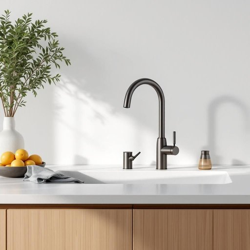

# faucet

<h1 style="font-size: 2.5em; font-weight: 300; letter-spacing: 2px; margin: 0; color: #2c3e50;">
/ˈfɔsət/
</h1>

---

---

## 例句

Could you please check if the kitchen faucet, which has been leaking slightly under the sink for weeks despite several attempts to tighten the joints and replace the washers, needs a complete replacement, or if it can still be fixed without calling a plumber?

*Could(/kʊd/) you(/ju/) please(/pliz/) check(/ʧɛk/) if(/ɪf/) the(/ðə/) kitchen(/ˈkɪʧən/) faucet,(/ˈfɔsət,/) which(/wɪʧ/) has(/həz/) been(/bɪn/) leaking(/ˈlikɪŋ/) slightly(/sˈlaɪtli/) under(/ˈəndər/) the(/ðə/) sink(/sɪŋk/) for(/fər/) weeks(/wiks/) despite(/dɪˈspaɪt/) several(/ˈsɛvərəl/) attempts(/əˈtɛmpts/) to(/tɪ/) tighten(/ˈtaɪtən/) the(/ðə/) joints(/ʤɔɪnts/) and(/ənd/) replace(/ˌriˈpleɪs/) the(/ðə/) washers,(/ˈwɑʃərz,/) needs(/nidz/) a(/ə/) complete(/kəmˈplit/) replacement,(/rɪˈpleɪsmənt,/) or(/ər/) if(/ɪf/) it(/ɪt/) can(/kən/) still(/stɪl/) be(/bi/) fixed(/fɪkst/) without(/wɪˈθaʊt/) calling(/ˈkɔlɪŋ/) a(/ə/) plumber?(/ˈpləmər?/)*

**翻译：** 请您帮忙检查一下这款厨房水龙头，尽管我们多次尝试拧紧接头和更换垫圈，但它在水槽下方仍然有轻微渗漏，这个水龙头是否需要完全更换，还是还能修理好，无需请水管工？

---

## 解释

英语单词“faucet”作为名词，主要指家庭或公共场所中用于控制水流的装置，即水龙头或阀门，常见于厨房、浴室的洗手盆、水槽或淋浴系统中。使用场合通常涉及日常生活中的用水场景，如“turn on the faucet”（打开水龙头）或“the faucet is leaking”（水龙头漏水）。英语学习者需要注意，“faucet”作为可数名词时通常用复数形式“faucets”，并且常见搭配包括“cold faucet”（冷水龙头）、“hot faucet”（热水龙头）、“kitchen faucet”（厨房水龙头）等。此外，与“tap”（主要英式英语）在词义上相近，但“faucet”更常见于美式英语。词源方面，“faucet”起源于中古法语“fausset”，意指小阀门，进一步来自拉丁语“faux”意为喉咙或水管，象征其控制水流的功能。在中文语境中，“faucet”对应的翻译为“水龙头”，是家庭和建筑装修中的常用名词，准确体现其功能和使用环境。该词语本身无特殊褒贬色彩，但在不同地区可能因习惯用词差异被视为美式或英式英语的代表词汇，理解时应关注语境和地区变体。

---

<small style="color: #999; font-size: 0.9em;">2025-07-27 09:14:04</small>

