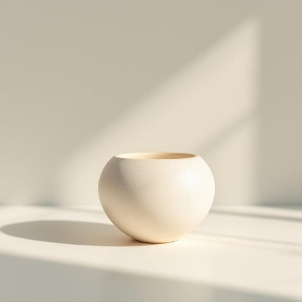

# figurine

<h1 style="font-size: 2.5em; font-weight: 300; letter-spacing: 2px; margin: 0; color: #2c3e50;">
/ˌfɪgjərˈin/
</h1>

---

---

## 例句

The knowledge gained from years of research in quantum mechanics fundamentally reshaped our understanding of the universe, demonstrating that particles can exist in multiple states simultaneously and challenging classical interpretations of reality with profound philosophical implications.

*The(/ðə/) knowledge(/ˈnɑlɪʤ/) gained(/geɪnd/) from(/frəm/) years(/jɪrz/) of(/əv/) research(/ˈrisərʧ/) in(/ɪn/) quantum(/kˈwɑntəm/) mechanics(/məˈkænɪks/) fundamentally(/ˌfəndəˈmɛnəli/) reshaped(/riˈʃeɪpt/) our(/ɑr/) understanding(/ˌəndərˈstændɪŋ/) of(/əv/) the(/ðə/) universe,(/ˈjunəˌvərs,/) demonstrating(/ˈdɛmənˌstreɪtɪŋ/) that(/ðət/) particles(/ˈpɑrtɪkəlz/) can(/kən/) exist(/ɪgˈzɪst/) in(/ɪn/) multiple(/ˈməltəpəl/) states(/steɪts/) simultaneously(/ˌsaɪməlˈteɪniəsli/) and(/ənd/) challenging(/ˈʧælənʤɪŋ/) classical(/ˈklæsɪkəl/) interpretations(/ˌɪnˌtərprɪˈteɪʃənz/) of(/əv/) reality(/ˌriˈæləˌti/) with(/wɪθ/) profound(/proʊˈfaʊnd/) philosophical(/ˌfɪləˈsɑfɪkəl/) implications.(/ˌɪmpləˈkeɪʃənz./)*

**翻译：** 多年来量子力学研究所获得的知识，从根本上重塑了我们对宇宙的理解，证明了粒子能够同时存在于多种状态之中，并以深刻的哲学意义挑战了经典的现实解读。

---

## 解释

figurine作为名词，主要指小型的雕塑或小摆件，通常由陶瓷、塑料、金属或树脂制成，常用于家居装饰，如放置在书架、茶几、展示柜等位置，以增添环境的艺术感或趣味性。在英语学习中，figurine为可数名词，复数形式为figurines，常见搭配有ceramic figurine（陶瓷小雕像）、decorative figurine（装饰性小摆件）和collectible figurine（收藏类小雕像），表达时可结合具体材质、用途或主题进行修饰。该词源自法语figurine，进一步源自拉丁语figura，意为形状或形象，体现小型形象或人物塑像含义。在中文语境中，figurine准确翻译为小雕像、小塑像或小摆件，强调尺寸小巧且多用于装饰，有时也译作陶瓷人偶或装饰小像，但需根据材质和用途区分。该词本身无明显褒贬色彩，属于中性描述，文化内涵常与收藏和装饰艺术相关，部分特殊题材的figurines可能具有民族或宗教象征意义，但在日常家居语境中主要体现审美和装饰功能。

---

<small style="color: #999; font-size: 0.9em;">2025-07-27 09:14:04</small>

