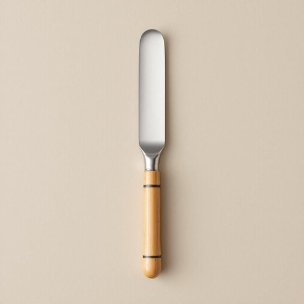

# file

<h1 style="font-size: 2.5em; font-weight: 300; letter-spacing: 2px; margin: 0; color: #2c3e50;">
/faɪl/
</h1>

---

---

## 例句

Could you please check the filing cabinet in the study for the latest project file, which should contain all the invoices and correspondence we received last month, because I need to review it before our meeting this afternoon?

*Could(/kʊd/) you(/ju/) please(/pliz/) check(/ʧɛk/) the(/ðə/) filing(/ˈfaɪlɪŋ/) cabinet(/ˈkæbənət/) in(/ɪn/) the(/ðə/) study(/ˈstədi/) for(/fər/) the(/ðə/) latest(/ˈleɪtəst/) project(/ˈprɑʤɛkt/) file,(/faɪl,/) which(/wɪʧ/) should(/ʃʊd/) contain(/kənˈteɪn/) all(/ɔl/) the(/ðə/) invoices(/ˈɪnvɔɪsɪz/) and(/ənd/) correspondence(/ˌkɔrəˈspɑndəns/) we(/wi/) received(/rɪˈsivd/) last(/læst/) month,(/mənθ,/) because(/bɪˈkəz/) I(/aɪ/) need(/nid/) to(/tɪ/) review(/ˌrivˈju/) it(/ɪt/) before(/ˌbiˈfɔr/) our(/ɑr/) meeting(/ˈmitɪŋ/) this(/ðɪs/) afternoon?(/ˌæftərˈnun?/)*

**翻译：** 请您帮忙查一下书房里的文件柜，找找最新的项目档案，里面应包含我们上个月收到的所有发票和往来信件，因为我需要在今天下午的会议前审阅这些材料。

---

## 解释

英语单词“file”在家居生活用品的语境中作为名词，通常指一种手工工具，即“锉刀”，用于打磨、修整金属、木材或指甲等表面，常见于家庭装修、手工制作或个人护理场合。使用时，英语学习者需注意“file”作为名词时是可数名词，通常搭配具体的形容词表示类型，如“nail file”（指甲锉）、“metal file”（金属锉）、“round file”（圆锉）等，且常与介词短语连用描述用途或形状，如“a file for smoothing edges”（用于抹平边缘的锉刀）。语法上，作名词的“file”多数情况下跟单数或复数形式，复数为“files”，在句中可作为主语、宾语或定语出现。词源上，“file”一词源自拉丁语“filum”，意为“线”，发展至中古英语，指用来磨平物体表面的细长金属工具，这一意义延续至今。中文语境中，“file”在家居用品中准确翻译为“锉刀”，强调其作为一种工具的功能和用途，不应与“文件”意义混淆。该词在日常生活中无褒贬色彩，属于中性实物名词，体现的是功能性和实用性，这种文化背景下的理解有助于避免误用或语义混淆。

---

<small style="color: #999; font-size: 0.9em;">2025-07-27 09:14:04</small>

