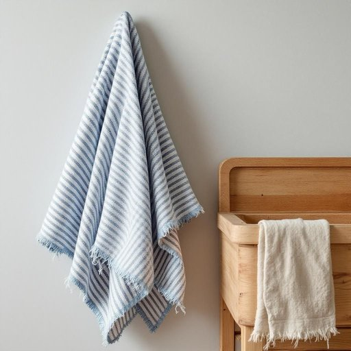

# flannel

<h1 style="font-size: 2.5em; font-weight: 300; letter-spacing: 2px; margin: 0; color: #2c3e50;">
/ˈflænəl/
</h1>

---

---

## 例句

After washing the dishes, could you please hand me the flannel that’s hanging by the kitchen sink, the one with the blue stripes and slightly frayed edges, since it’s much more absorbent and gentle on the wood than the usual sponges we keep cluttered on the counter?

*After(/ˈæftər/) washing(/ˈwɑʃɪŋ/) the(/ðə/) dishes,(/ˈdɪʃɪz,/) could(/kʊd/) you(/ju/) please(/pliz/) hand(/hænd/) me(/mi/) the(/ðə/) flannel(/ˈflænəl/) that’s(/that’s*/) hanging(/ˈhæŋɪŋ/) by(/baɪ/) the(/ðə/) kitchen(/ˈkɪʧən/) sink,(/sɪŋk,/) the(/ðə/) one(/wən/) with(/wɪθ/) the(/ðə/) blue(/blu/) stripes(/straɪps/) and(/ənd/) slightly(/sˈlaɪtli/) frayed(/freɪd/) edges,(/ˈɛʤɪz,/) since(/sɪns/) it’s(/it’s*/) much(/məʧ/) more(/mɔr/) absorbent(/əbˈzɔrbənt/) and(/ənd/) gentle(/ˈʤɛnəl/) on(/ɔn/) the(/ðə/) wood(/wʊd/) than(/ðən/) the(/ðə/) usual(/ˈjuʒəwəl/) sponges(/ˈspənʤɪz/) we(/wi/) keep(/kip/) cluttered(/ˈklətərd/) on(/ɔn/) the(/ðə/) counter?(/ˈkaʊntər?/)*

**翻译：** 洗完碗后，能请你把挂在厨房水槽旁、带蓝色条纹且边缘略显磨损的那块法兰绒递给我吗？因为它比我们通常放在台面上杂乱的海绵更吸水，也更温和，不会伤害木质表面。

---

## 解释

英语单词“flannel”作为名词在家居生活用品的语境中，通常指一种柔软、轻薄且略带绒面的棉织物或毛织物，广泛用于制作床单、睡衣、毛巾、手帕或擦拭布等日常用品，因其触感温暖舒适，尤其适合寒冷季节使用。使用该词时，英语学习者需注意其可数或不可数属性可根据具体指代的物品不同而变化，如一块绒布可称为 a piece of flannel，而 flannel 本身也可作为不可数名词表示材料。常见搭配包括 flannel shirt（法兰绒衬衫）、flannel sheets（法兰绒床单）、wash with flannel（用绒布擦洗）等，表达时要结合上下文语境避免误用，因为 flannel 在英国口语中也可指代虚词废话，不过在家居用品方面无此含义。关于词源，flannel 源于威尔士语 gwlanen，意指羊毛织物，最初指以羊毛制成的柔软布料，后来泛指类似材质的棉织物。中文语境中，flannel 一般准确翻译为法兰绒，强调其柔软且带绒毛的质地，体现了其保暖和舒适的特性，是描述家居纺织品时的标准用词，通常无褒贬色彩，属于中性词汇，文化内涵主要关联其在英美冬季服饰和床上用品中的广泛使用和舒适形象。

---

<small style="color: #999; font-size: 0.9em;">2025-07-27 09:14:04</small>

