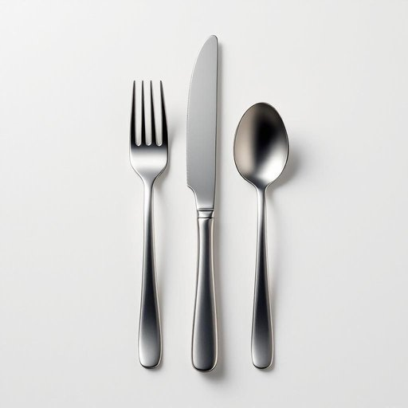

# flatware

<h1 style="font-size: 2.5em; font-weight: 300; letter-spacing: 2px; margin: 0; color: #2c3e50;">
/ˈflætˌwɛr/
</h1>

---

---

## 例句

Could you please polish the flatware that we used for dinner yesterday, including the knives, forks, and spoons, before setting the table for tonight’s guests, as I want everything to look pristine and well-arranged?

*Could(/kʊd/) you(/ju/) please(/pliz/) polish(/ˈpɑlɪʃ/) the(/ðə/) flatware(/ˈflætˌwɛr/) that(/ðət/) we(/wi/) used(/juzd/) for(/fər/) dinner(/ˈdɪnər/) yesterday,(/ˈjɛstərˌdeɪ,/) including(/ˌɪnˈkludɪŋ/) the(/ðə/) knives,(/naɪvz,/) forks,(/fɔrks,/) and(/ənd/) spoons,(/spunz,/) before(/ˌbiˈfɔr/) setting(/ˈsɛtɪŋ/) the(/ðə/) table(/ˈteɪbəl/) for(/fər/) tonight’s(/tonight’s*/) guests,(/gɛsts,/) as(/ɛz/) I(/aɪ/) want(/wɔnt/) everything(/ˈɛvriˌθɪŋ/) to(/tɪ/) look(/lʊk/) pristine(/ˈprɪstin/) and(/ənd/) well-arranged?(/well-arranged*?/)*

**翻译：** 请您帮忙把我们昨天晚餐用过的餐具，包括刀子、叉子和勺子，都擦拭干净，再摆放到今晚客人的餐桌上，我希望一切都显得洁净如新、整齐有序。

---

## 解释

英语单词“flatware”作为名词，主要指家居生活用品中用于进餐的餐具，具体包括刀、叉、勺等金属制餐具，尤其是在正式或日常用餐场合中使用，如家庭晚餐、餐馆服务和宴会布置等语境中常见。英语学习者需注意，“flatware”通常是不可数名词，指一类物品，不能直接用复数形式；在搭配上常见表达包括“silver flatware”（银质餐具）、“stainless steel flatware”（不锈钢餐具）或“set of flatware”（一套餐具），表达时多用量词set或pieces。语法上，flatware作为集合名词在句中作主语或宾语时动词可用复数或单数，视语境和说话者习惯而定，但一般倾向复数。词源上，“flatware”由“flat”（平的）和“ware”（器具）组成，最初指形状较为扁平且为金属制的餐具，强调其形态特点，起源于19世纪末至20世纪初的英语，区别于“hollowware”（空心器具，如锅、壶）一类餐厨用具。中文中，“flatware”准确翻译为“餐具”或“餐刀叉勺”，但应区别于更广义的“餐具”概念，因为“flatware”专指餐刀叉勺这类“金属平餐具”，而非包括碗碟等陶瓷器皿。在中文语境下理解时，应避免将其与“餐具”泛指混淆，强调其指金属餐具的专业性。该词通常无褒贬含义，属于中性词汇，文化上反映了西餐餐具体系的标准分类，与中餐使用筷子的文化背景存在差异，了解这一点有助于语言学习者更好地把握“flatware”的使用环境和文化内涵。

---

<small style="color: #999; font-size: 0.9em;">2025-07-27 09:14:04</small>

