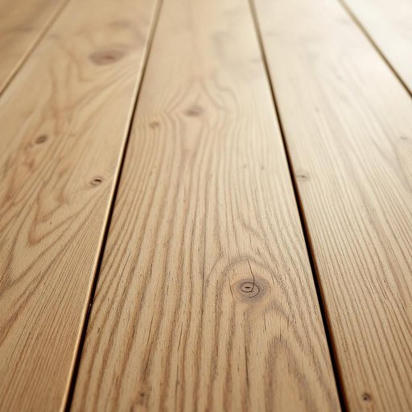

# floor

<h1 style="font-size: 2.5em; font-weight: 300; letter-spacing: 2px; margin: 0; color: #2c3e50;">
/flɔr/
</h1>

---

---

## 例句

After we finished sanding the old wooden floor, which had been scratched and stained from years of use, we decided to apply two coats of a clear varnish to ensure it would be both durable and easy to clean in the busy household.

*After(/ˈæftər/) we(/wi/) finished(/ˈfɪnɪʃt/) sanding(/ˈsændɪŋ/) the(/ðə/) old(/oʊld/) wooden(/ˈwʊdən/) floor,(/flɔr,/) which(/wɪʧ/) had(/hæd/) been(/bɪn/) scratched(/skræʧt/) and(/ənd/) stained(/steɪnd/) from(/frəm/) years(/jɪrz/) of(/əv/) use,(/juz,/) we(/wi/) decided(/ˌdɪˈsaɪdɪd/) to(/tɪ/) apply(/əˈplaɪ/) two(/tu/) coats(/koʊts/) of(/əv/) a(/ə/) clear(/klɪr/) varnish(/ˈvɑrnɪʃ/) to(/tɪ/) ensure(/ɪnˈʃʊr/) it(/ɪt/) would(/wʊd/) be(/bi/) both(/boʊθ/) durable(/ˈdʊrəbəl/) and(/ənd/) easy(/ˈizi/) to(/tɪ/) clean(/klin/) in(/ɪn/) the(/ðə/) busy(/ˈbɪzi/) household.(/ˈhaʊsˌhoʊld./)*

**翻译：** 在我们打磨完这块多年使用中留下划痕和污渍的旧木地板后，决定涂抹两遍透明清漆，以确保地板既耐用，又便于在忙碌的家庭环境中清洁。

---

## 解释

英语单词“floor”作为名词在家居生活用品的语境中主要指房间或建筑物内部的地面，即人们行走的水平表面，常用于描述铺设材料如木地板、瓷砖或地毯等。例如在说“the kitchen floor is tiled”（厨房地面铺了瓷砖）时即指具体的地面表层。学习者在使用时应注意“floor”作为可数名词时，还可指建筑的“楼层”，需根据语境区分，这里侧重指地面层面。此外，“on the floor”是常见搭配，表示“在地板上”，而动词形式“to floor”则有使惊讶或击倒的意思，与名词意义区分明显。词源来自古英语“flōr”，源于拉丁语“plānum”，意为平坦的表面，反映了其指水平地面的本义。在中文语境中，“floor”作为家居用品时准确翻译为“地板”或“地面”，强调的是构成室内行走表面的材料或结构，与建筑的“楼层”区别明显。该词本身无特殊褒贬色彩，使用广泛，中性，符合描述家庭环境时的常用词汇。

---

<small style="color: #999; font-size: 0.9em;">2025-07-27 09:14:04</small>

