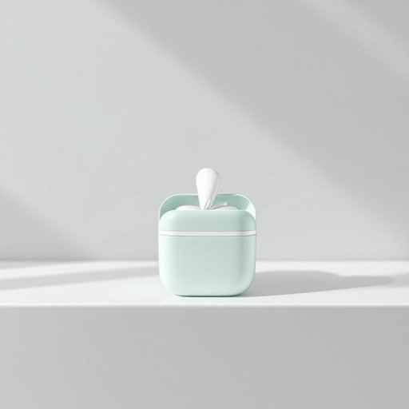

# floss

<h1 style="font-size: 2.5em; font-weight: 300; letter-spacing: 2px; margin: 0; color: #2c3e50;">
/flɑs/
</h1>

---

---

## 例句

Before you head to bed, don’t forget to grab the mint-flavoured floss from the bathroom cabinet, which, despite its small size, plays a crucial role in maintaining your dental hygiene by removing plaque and food particles stuck between your teeth that a toothbrush alone simply can’t reach.

*Before(/ˌbiˈfɔr/) you(/ju/) head(/hɛd/) to(/tɪ/) bed,(/bɛd,/) don’t(/don’t*/) forget(/fərˈgɛt/) to(/tɪ/) grab(/græb/) the(/ðə/) mint-flavoured(/mint-flavoured*/) floss(/flɑs/) from(/frəm/) the(/ðə/) bathroom(/ˈbæθˌrum/) cabinet,(/ˈkæbənət,/) which,(/wɪʧ,/) despite(/dɪˈspaɪt/) its(/ɪts/) small(/smɔl/) size,(/saɪz,/) plays(/pleɪz/) a(/ə/) crucial(/ˈkruʃəl/) role(/roʊl/) in(/ɪn/) maintaining(/meɪnˈteɪnɪŋ/) your(/jʊr/) dental(/ˈdɛntəl/) hygiene(/ˈhaɪˌʤin/) by(/baɪ/) removing(/riˈmuvɪŋ/) plaque(/plæk/) and(/ənd/) food(/fud/) particles(/ˈpɑrtɪkəlz/) stuck(/stək/) between(/bɪtˈwin/) your(/jʊr/) teeth(/tiθ/) that(/ðət/) a(/ə/) toothbrush(/ˈtuθbrəʃ/) alone(/əˈloʊn/) simply(/ˈsɪmpli/) can’t(/can’t*/) reach.(/riʧ./)*

**翻译：** 临睡前别忘了从浴室橱柜里取出薄荷味的牙线。它虽小，却在维护口腔卫生方面发挥着关键作用，能有效清除牙刷难以触及的牙缝间牙菌斑和食物残渣。

---

## 解释

英语单词“floss”作为名词，在家居生活用品的语境中主要指“牙线”，即用于清洁牙齿缝隙的细线状清洁工具，常见于口腔护理和牙齿卫生相关场合，如刷牙后使用，以去除牙菌斑和食物残渣，预防牙龈疾病和蛀牙。英语学习者在使用“floss”时应注意，作为不可数名词时通常指牙线整体，如“use floss daily”，而作为可数名词时可指具体的一段牙线，搭配常见表达有“dental floss”（牙线），常用动词搭配如“use floss”，“buy floss”，“pick up floss”等，且不能与动词“floss”混淆，后者作为动词有“用牙线清洁”的意思；此外，“floss”作为名词发音为/flɒs/，需区分其他多义词义。词源上，“floss”源自中世纪英语，意为细软的纤维或棉絮，后来引申为细线，牙线的含义则在19世纪后期随着口腔卫生意识普及而发展出来。在中文语境中，“floss”准确翻译为“牙线”，这是最常见且标准的说法，反映其具体功能和用途，没有褒贬色彩或特殊文化内涵，只是口腔护理中不可缺少的工具之一；应避免将其误解为其他意义如“花边”“棉絮”等，以免引起混淆。

---

<small style="color: #999; font-size: 0.9em;">2025-07-27 09:14:04</small>

