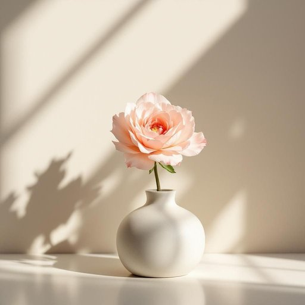

# flower

<h1 style="font-size: 2.5em; font-weight: 300; letter-spacing: 2px; margin: 0; color: #2c3e50;">
/flaʊər/
</h1>

---

---

## 例句

The perseverance of the artist, who tirelessly refined every detail of the sculpture despite numerous setbacks, ultimately resulted in a masterpiece that captivated critics and collectors alike.

*The(/ðə/) perseverance(/ˌpərsəˈvɪrəns/) of(/əv/) the(/ðə/) artist,(/ˈɑrtɪst,/) who(/hu/) tirelessly(/ˈtaɪrləsli/) refined(/rɪˈfaɪnd/) every(/ˈɛvəri/) detail(/ˈditeɪl/) of(/əv/) the(/ðə/) sculpture(/ˈskəlpʧər/) despite(/dɪˈspaɪt/) numerous(/ˈnumərəs/) setbacks,(/ˈsɛtˌbæks,/) ultimately(/ˈəltəmətli/) resulted(/rɪˈzəltɪd/) in(/ɪn/) a(/ə/) masterpiece(/ˈmæstərˌpis/) that(/ðət/) captivated(/ˈkæptɪˌveɪtɪd/) critics(/ˈkrɪtɪks/) and(/ənd/) collectors(/kəˈlɛktərz/) alike.(/əˈlaɪk./)*

**翻译：** 艺术家不懈的坚持，在经历诸多挫折后仍孜孜不倦地打磨每一处细节，最终铸就了一件令评论家与藏家同为之倾倒的杰作。

---

## 解释

英语单词"flower"作为名词在家居生活用品场景中，主要指装饰用的花卉或鲜花，如插在花瓶里的花束、用来美化居室的花朵等，常见于描述室内陈设、装饰风格或园艺用品时使用。学习者在使用"flower"时需注意其单复数变化（单数flower，复数flowers），且作为可数名词时通常指具体的一朵花或若干朵花，常与形容词如fresh（鲜花）、artificial（人造花）、cut（切花）等搭配，表达方式多样，如“一束花”（a bouquet of flowers）、“插花”（flower arrangement）等。此外，“flower”在某些固定短语如“flower pot”（花盆）中虽包含flower，但实际指花盆这一器具，而非花本身。词源上，"flower"源自古法语"flor"或"flour"，追溯到拉丁语"flos, floris"，意为开花植物的花朵，体现了植物美丽、生命力的象征意义。在中文语境中，"flower"通常被准确翻译为“花”或“鲜花”，强调其作为植物开花部分的自然美和装饰作用，适用于家居环境中的摆设与点缀。文化上，花在中西方均具有美好、欣赏和情感表达的含义，英文中“flower”一般没有贬义，常带有积极、柔美的色彩，是日常生活中温馨和雅致的象征。

---

<small style="color: #999; font-size: 0.9em;">2025-07-27 09:14:04</small>

