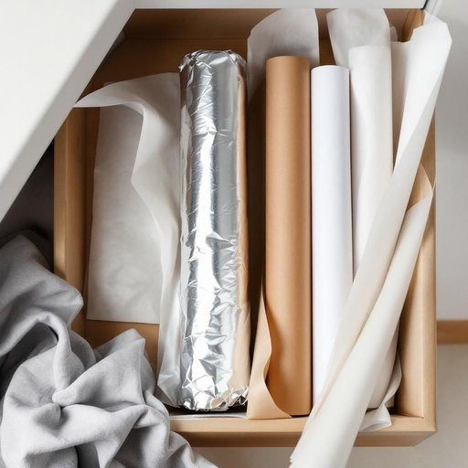

# foil

<h1 style="font-size: 2.5em; font-weight: 300; letter-spacing: 2px; margin: 0; color: #2c3e50;">
/fɔɪl/
</h1>

---

---

## 例句

Could you please pass me the foil from the kitchen drawer, the roll that’s next to the cling film and parchment paper, so I can wrap up the leftovers before popping them into the fridge?

*Could(/kʊd/) you(/ju/) please(/pliz/) pass(/pæs/) me(/mi/) the(/ðə/) foil(/fɔɪl/) from(/frəm/) the(/ðə/) kitchen(/ˈkɪʧən/) drawer,(/drɔr,/) the(/ðə/) roll(/roʊl/) that’s(/that’s*/) next(/nɛkst/) to(/tɪ/) the(/ðə/) cling(/klɪŋ/) film(/fɪlm/) and(/ənd/) parchment(/ˈpɑrʧmənt/) paper,(/ˈpeɪpər,/) so(/soʊ/) I(/aɪ/) can(/kən/) wrap(/ræp/) up(/əp/) the(/ðə/) leftovers(/ˈlɛfˌtoʊvərz/) before(/ˌbiˈfɔr/) popping(/ˈpɑpɪŋ/) them(/ðɛm/) into(/ˈɪntu/) the(/ðə/) fridge?(/frɪʤ?/)*

**翻译：** 你能帮我从厨房的抽屉里拿一下锡纸吗？就是贴着保鲜膜和烘焙纸那一卷，我想用它把剩菜包好再放进冰箱。

---

## 解释

英语单词“foil”在家居生活用品场景中作为名词，通常指“铝箔”或“锡纸”，主要用于食品的包装、保存或烹饪过程中防止水分流失和保持食物的新鲜。具体使用场合包括厨房中用于包裹剩饭菜、覆盖烤盘、防止烤箱中的食物直接接触火焰等。英语学习者在使用“foil”时应注意其不可数名词的用法，通常不直接用复数形式“foils”来指代多张铝箔（但在某些情况下“foils”可指多片包装好的铝箔片），常见搭配有“aluminum foil”（铝箔）、“tin foil”（锡纸，虽现代多指铝箔）以及“wrap something in foil”（用锡纸包裹某物）等。语法上，“foil”作为名词时多用于不可数或作为具体物品名词，而非抽象意义。词源方面，“foil”最早源自中古英语，意指“薄片”一类物质，后来引申应用指薄金属片，现代家用铝箔即由此发展而来。在中文语境中，准确翻译常为“铝箔”或“锡纸”，且使用时需根据实际材料区别，传统“锡纸”指的是早期的锡制薄片，现代更多为铝材质，因此“铝箔”更加准确且通用。该词在家居用品语境下无特殊褒贬含义，属于中性实用名词，文化内涵主要与家庭烹饪和食品保存相关，理解时应避免与其作为动词时的“挫败、阻止”等其他非物质含义混淆。

---

<small style="color: #999; font-size: 0.9em;">2025-07-27 09:14:04</small>

