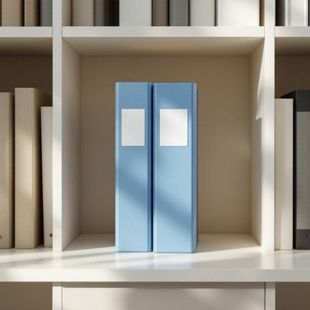

# folder

<h1 style="font-size: 2.5em; font-weight: 300; letter-spacing: 2px; margin: 0; color: #2c3e50;">
/ˈfoʊldər/
</h1>

---

---

## 例句

Could you please grab the folder from the bookshelf, the one with the blue label that contains all the important bills and warranty documents we've been meaning to organise before the end of the month?

*Could(/kʊd/) you(/ju/) please(/pliz/) grab(/græb/) the(/ðə/) folder(/ˈfoʊldər/) from(/frəm/) the(/ðə/) bookshelf,(/ˈbʊkˌʃɛlf,/) the(/ðə/) one(/wən/) with(/wɪθ/) the(/ðə/) blue(/blu/) label(/ˈleɪbəl/) that(/ðət/) contains(/kənˈteɪnz/) all(/ɔl/) the(/ðə/) important(/ˌɪmˈpɔrtənt/) bills(/bɪlz/) and(/ənd/) warranty(/ˈwɔrənti/) documents(/ˈdɑkjəmənts/) we've(/wiv/) been(/bɪn/) meaning(/ˈminɪŋ/) to(/tɪ/) organise(/organise*/) before(/ˌbiˈfɔr/) the(/ðə/) end(/ɛnd/) of(/əv/) the(/ðə/) month?(/mənθ?/)*

**翻译：** 麻烦你从书架上拿一下那个文件夹，就是带有蓝色标签的那个，里面装着我们一直打算在月底前整理的所有重要账单和保修文件。

---

## 解释

英语单词"folder"在家居生活用品的语境中作为名词，通常指用来整理和存放纸张、文件的文件夹，常见于书桌、办公桌或书房中，用于分类保存重要的纸质资料或个人文件，方便取用和管理。英语学习者在使用"folder"时应注意，它是可数名词，复数形式为"folders"，可与定冠词、指示代词等连用，例如"the folder"、"this folder"等；常见搭配有"file folder"（文件夹）、"plastic folder"（塑料文件夹）、"folder for documents"（文件夹），在表达时也常用短语"put documents in a folder"（把文件放进文件夹）或"organize papers in folders"（用文件夹整理文件）。词源上，"folder"源自动词"fold"（折叠），最初指可以折叠的物品，后来特指用于折叠并保存纸张的工具，反映了其功能特性。中文语境中，"folder"准确对应“文件夹”或“文件册”，强调其收纳和整理文件的用途，没有褒贬色彩或特殊文化内涵，是办公和家居生活中常见且实用的整理工具。

---

<small style="color: #999; font-size: 0.9em;">2025-07-27 09:14:04</small>

