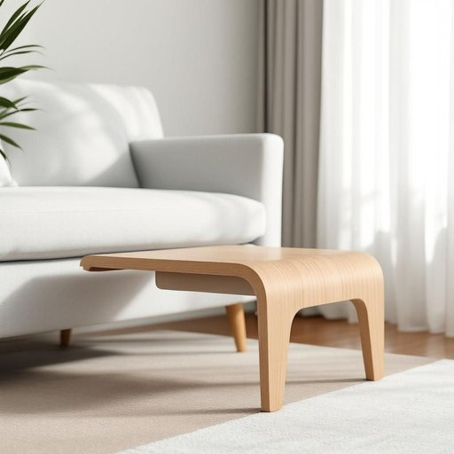

# footrest

<h1 style="font-size: 2.5em; font-weight: 300; letter-spacing: 2px; margin: 0; color: #2c3e50;">
/footrest*/
</h1>

---

---

## 例句

After the conference, the entrepreneur’s vision of innovation became a driving force behind the industry’s rapid growth.

*After(/ˈæftər/) the(/ðə/) conference,(/ˈkɑnfərəns,/) the(/ðə/) entrepreneur’s(/entrepreneur’s*/) vision(/ˈvɪʒən/) of(/əv/) innovation(/ˌɪnəˈveɪʃən/) became(/bɪˈkeɪm/) a(/ə/) driving(/ˈdraɪvɪŋ/) force(/fɔrs/) behind(/bɪˈhaɪnd/) the(/ðə/) industry’s(/industry’s*/) rapid(/ˈræpɪd/) growth.(/groʊθ./)*

**翻译：** 会议结束后，这位企业家的创新愿景成为行业快速发展的推动力。

---

## 解释

footrest作为名词，在家居生活用品的语境中指的是供人将脚放置其上的家具部件或装置，通常用来提升坐姿的舒适度，减轻腿部疲劳，常见于沙发、躺椅、办公椅等座椅旁边，有时也指专门的脚凳。具体使用场合多见于描述家具功能、家庭装修建议或购买指南等语境，如The chair comes with a built-in footrest（这把椅子带有内置的脚踏）。footrest是一个可数名词，使用时通常带有冠词，根据语境可使用单数或复数形式，如a footrest或footrests；常见的搭配包括adjustable footrest（可调节脚踏）、comfortable footrest（舒适的脚踏）、attached footrest（附加的脚踏）等，英语学习者应注意区别footrest与类似词如footstool（脚凳）、ottoman（软脚凳）等，避免混淆。词源上，footrest由foot（脚）和rest（休息、支撑）两个词合成，字面含义即脚的休息处，反映其功能属性。该词在中文语境中的准确翻译通常为脚踏或脚凳，视具体物品的形态和用途略有区别，但整体理解均指为脚提供支撑和休息的平台或装置。它属于中性词汇，无贬义或褒义色彩，也无特殊文化隐喻，主要体现实用功能。

---

<small style="color: #999; font-size: 0.9em;">2025-07-27 09:14:04</small>

