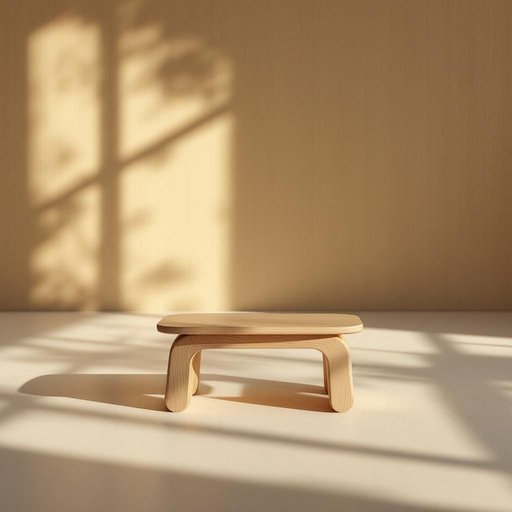

# footstool

<h1 style="font-size: 2.5em; font-weight: 300; letter-spacing: 2px; margin: 0; color: #2c3e50;">
/footstool*/
</h1>

---

---

## 例句

After a long day of work, the cosy provided a comforting refuge where she could finally relax.

*After(/ˈæftər/) a(/ə/) long(/lɔŋ/) day(/deɪ/) of(/əv/) work,(/wərk,/) the(/ðə/) cosy(/ˈkoʊzi/) provided(/prəˈvaɪdɪd/) a(/ə/) comforting(/ˈkəmfərtɪŋ/) refuge(/ˈrɛfjuʤ/) where(/wɛr/) she(/ʃi/) could(/kʊd/) finally(/ˈfaɪnəli/) relax.(/rɪˈlæks./)*

**翻译：** 经过一天的辛劳，温馨的环境为她提供了一个舒适的避风港，让她终于得以放松身心。

---

## 解释

英语单词footstool作为名词，主要指一种小型家具，通常放置在椅子或沙发前，用来支撑和抬高双脚，提供舒适的休息体验，常见于客厅、书房等家居环境中。在使用时，footstool通常与动词如rest或put搭配，如rest your feet on the footstool（把脚放在脚凳上）。其语法特点为可数名词，单数形式footstool，复数形式footstools，在表达时需注意搭配正确的冠词和数量词。此外，footstool作为复合词由foot（脚）和stool（凳子、座位）组成，词源清晰，字面意思即用于脚的凳子，起源于古英语及中古英语的家具用语，反映了该物品的功能属性。在中文语境中，footstool通常被翻译为脚凳或脚踏凳，强调其放脚和休息的功能，属于中性词汇，无明显褒贬和特殊文化内涵，但在某些正式或文学语境中也可能引申为臣服、服从的隐喻用法，这种用法源自圣经及文学中将脚凳比作权力等级的象征，但在日常家居用语中一般无此含义。使用时应根据语境选择适当的中文译法，以确保准确传达其家具与使用功能。

---

<small style="color: #999; font-size: 0.9em;">2025-07-27 09:14:04</small>

