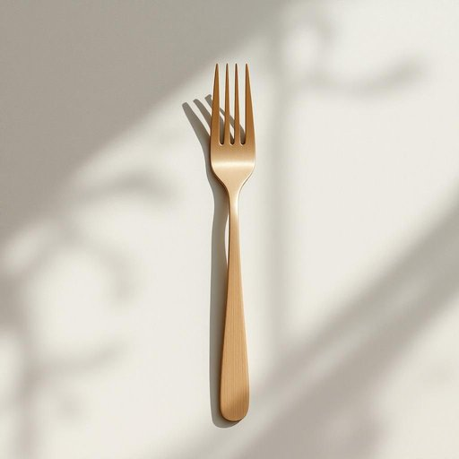

# fork

<h1 style="font-size: 2.5em; font-weight: 300; letter-spacing: 2px; margin: 0; color: #2c3e50;">
/fɔrk/
</h1>

---

---

## 例句

Could you please hand me the fork that’s lying next to the knives on the dining table, the one with the slightly bent tine, so I can properly twirl the spaghetti without it slipping off?

*Could(/kʊd/) you(/ju/) please(/pliz/) hand(/hænd/) me(/mi/) the(/ðə/) fork(/fɔrk/) that’s(/that’s*/) lying(/laɪɪŋ/) next(/nɛkst/) to(/tɪ/) the(/ðə/) knives(/naɪvz/) on(/ɔn/) the(/ðə/) dining(/ˈdaɪnɪŋ/) table,(/ˈteɪbəl,/) the(/ðə/) one(/wən/) with(/wɪθ/) the(/ðə/) slightly(/sˈlaɪtli/) bent(/bɛnt/) tine,(/taɪn,/) so(/soʊ/) I(/aɪ/) can(/kən/) properly(/ˈprɑpərli/) twirl(/twərl/) the(/ðə/) spaghetti(/spəˈgɛti/) without(/wɪˈθaʊt/) it(/ɪt/) slipping(/sˈlɪpɪŋ/) off?(/ɔf?/)*

**翻译：** 请你把餐桌上刀子旁边那把叉子递给我，就是那把有点弯曲的叉齿，这样我才能顺利地把意大利面卷起来，不让它滑落。

---

## 解释

“fork”作为名词在家居生活用品的语境中，通常指餐具中的“叉子”，用于吃饭时刺取或夹取食物。具体使用场合包括家庭用餐、餐厅、厨房摆设等，表达时多见于描述用餐工具、餐具组合或餐桌布置等场景。英语学习者应注意，“fork”作为可数名词，有单数和复数形式（fork/forks），且常与动词搭配使用，如“use a fork”（使用叉子）、“set the table with forks”（用叉子摆放餐桌）等。同时，fork常与“knife”（刀）、“spoon”（勺子）构成常见的餐具组合表达，如“fork and knife”或“fork, spoon, and knife”。词源方面，“fork”源自拉丁语“furca”，意指分叉的工具或结构，后来演变为指餐具中的叉状物，形象地反映了叉子的分支形状。在中文语境中，“fork”准确翻译为“叉子”，强调其实用功能和形态特征。在使用时无明显褒贬色彩，是餐桌上不可或缺的常用餐具。需注意的是，除了餐具意义外，“fork”还有其他含义，如道路分岔、计算机分支等，需根据语境辨别，但在家居生活用品场景下，默认指餐具“叉子”。

---

<small style="color: #999; font-size: 0.9em;">2025-07-27 09:14:04</small>

