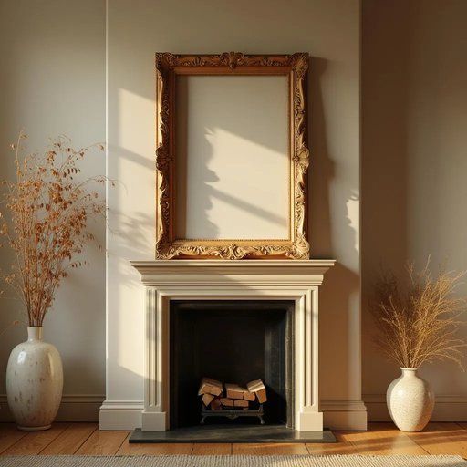

# frame

<h1 style="font-size: 2.5em; font-weight: 300; letter-spacing: 2px; margin: 0; color: #2c3e50;">
/freɪm/
</h1>

---

---

## 例句

Could you please help me hang this vintage frame, which I found at the market last weekend and has an intricate carved border, above the fireplace in the living room to complement the overall rustic aesthetic we’ve been trying to achieve?

*Could(/kʊd/) you(/ju/) please(/pliz/) help(/hɛlp/) me(/mi/) hang(/hæŋ/) this(/ðɪs/) vintage(/ˈvɪntɪʤ/) frame,(/freɪm,/) which(/wɪʧ/) I(/aɪ/) found(/faʊnd/) at(/æt/) the(/ðə/) market(/ˈmɑrkɪt/) last(/læst/) weekend(/ˈwiˌkɪnd/) and(/ənd/) has(/həz/) an(/ən/) intricate(/ˈɪntrəkət/) carved(/kɑrvd/) border,(/ˈbɔrdər,/) above(/əˈbəv/) the(/ðə/) fireplace(/ˈfaɪərˌpleɪs/) in(/ɪn/) the(/ðə/) living(/ˈlɪvɪŋ/) room(/rum/) to(/tɪ/) complement(/ˈkɑmpləmənt/) the(/ðə/) overall(/ˈoʊvərˌɔl/) rustic(/ˈrəstɪk/) aesthetic(/ɛsˈθɛtɪk/) we’ve(/we’ve*/) been(/bɪn/) trying(/traɪɪŋ/) to(/tɪ/) achieve?(/əˈʧiv?/)*

**翻译：** 您能帮我把这幅上周末在市场上买到的复古相框挂在客厅壁炉上方吗？这相框边缘雕刻精美，能很好地呼应我们一直想营造的整体田园风格。

---

## 解释

英语单词“frame”在家居生活用品语境中作为名词，通常指用于支撑、围绕或固定物体的结构或框架，比如相框、镜框、床架、窗框等具体物品，常见于描述家中装饰、家具或建筑构造时。学习者在使用时需注意“frame”作为可数名词，常用复数形式“frames”表示多个框架；此外，它常与具体物体搭配，如“picture frame”（画框）、“window frame”（窗框）、“door frame”（门框）等，表达准确且自然。同时，“frame”可用于构造短语如“wooden frame”（木制框架）或“metal frame”（金属框架）来进一步限定材料属性。该词来源于中古英语“fram”，其根源追溯到古英语“framian”，意指“支持、制造”，体现了其作为支撑结构的本质。中文语境中，“frame”主要翻译为“框架”或“框”，依据具体物品可译为“相框”、“框架”、“床架”等，强调其在家居中承载、支持或装饰的功能；这一词汇通常没有特别的感情色彩或褒贬义，属于中性词，使用时注意区分具体指代，避免与抽象含义混淆。

---

<small style="color: #999; font-size: 0.9em;">2025-07-27 09:14:04</small>

