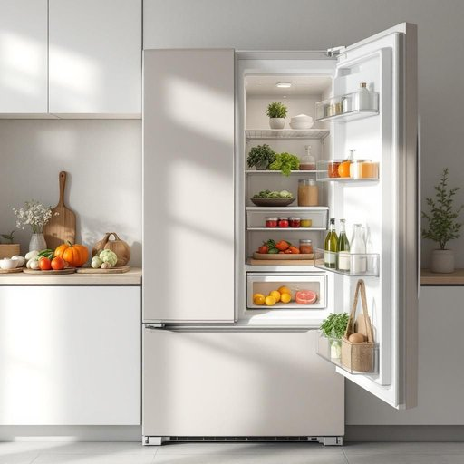

# freezer

<h1 style="font-size: 2.5em; font-weight: 300; letter-spacing: 2px; margin: 0; color: #2c3e50;">
/ˈfrizər/
</h1>

---

---

## 例句

Before we start cooking dinner, could you please check if there’s enough room in the freezer, especially near the back where we usually store the frozen vegetables and the leftover curry, because I just bought a large batch of ingredients that need to be kept frozen until the weekend.

*Before(/ˌbiˈfɔr/) we(/wi/) start(/stɑrt/) cooking(/ˈkʊkɪŋ/) dinner,(/ˈdɪnər,/) could(/kʊd/) you(/ju/) please(/pliz/) check(/ʧɛk/) if(/ɪf/) there’s(/there’s*/) enough(/ɪˈnəf/) room(/rum/) in(/ɪn/) the(/ðə/) freezer,(/ˈfrizər,/) especially(/əˈspɛʃəli/) near(/nɪr/) the(/ðə/) back(/bæk/) where(/wɛr/) we(/wi/) usually(/ˈjuʒəwəli/) store(/stɔr/) the(/ðə/) frozen(/ˈfroʊzən/) vegetables(/ˈvɛʤtəbəlz/) and(/ənd/) the(/ðə/) leftover(/ˈlɛfˌtoʊvər/) curry,(/ˈkəri,/) because(/bɪˈkəz/) I(/aɪ/) just(/ʤɪst/) bought(/bɔt/) a(/ə/) large(/lɑrʤ/) batch(/bæʧ/) of(/əv/) ingredients(/ˌɪnˈgridiənts/) that(/ðət/) need(/nid/) to(/tɪ/) be(/bi/) kept(/kɛpt/) frozen(/ˈfroʊzən/) until(/ənˈtɪl/) the(/ðə/) weekend.(/ˈwiˌkɪnd./)*

**翻译：** 在我们开始准备晚餐之前，能否先帮忙检查一下冰箱冷冻室是否有足够的空间，特别是我们通常放置冷冻蔬菜和剩余咖喱的后部位置？因为我刚买了一大批需要冷冻保存直到周末的食材。

---

## 解释

“freezer”作为名词，在家居生活用品的场景中指的是用来冷冻和长期储存食物的电器设备，通常安装于厨房。具体使用场合包括家庭厨房、餐厅或其他需要冷藏冷冻食物的环境，语境中常见表达如“put the meat in the freezer”（把肉放进冰柜）、“a chest freezer”（卧式冰柜）等。英语学习者应注意，freezer通常作为可数名词使用，复数形式为freezers；与此同时，它可以与限定词连用，如“the freezer is full”或“my freezer broke down”。与其搭配的常见词汇有“freezer compartment”（冰箱冷冻室）、“freezer bag”（冷冻袋）等，表达时注意区分与冰箱（refrigerator）的不同，freezer特指冷冻部分或冷冻设备。词源来自英语动词“freeze”的名词派生形式，意指能够使物品冻结的设备，起源于19世纪末电冰箱及冷冻技术兴起时期。中文里“freezer”准确翻译为“冰柜”或“冰箱冷冻室”，指代可以将食物冻结保存的家用电器部分，理解时需避免与普通冰箱混淆。freezer本身无褒贬含义，属于中性词汇，但在口语中有时暗含储存空间不足或设备老化导致效率低下等不便含义，因而在生活对话中可能带有轻微的抱怨色彩。整体而言，“freezer”是厨房中不可或缺的冷冻设备的标准称呼，掌握其用法对于描述家庭储存冷冻食品的情境尤为重要。

---

<small style="color: #999; font-size: 0.9em;">2025-07-27 09:14:04</small>

