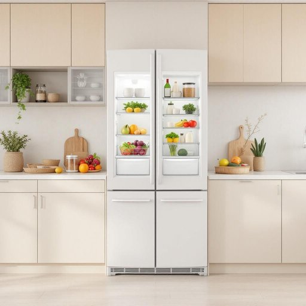

# fridge

<h1 style="font-size: 2.5em; font-weight: 300; letter-spacing: 2px; margin: 0; color: #2c3e50;">
/frɪʤ/
</h1>

---

---

## 例句

The fridge in the kitchen, which has been renovated recently to include advanced cooling technology and energy-efficient features, contains a variety of fresh vegetables and dairy products that need to be inspected before dinner preparation begins.

*The(/ðə/) fridge(/frɪʤ/) in(/ɪn/) the(/ðə/) kitchen,(/ˈkɪʧən,/) which(/wɪʧ/) has(/həz/) been(/bɪn/) renovated(/ˈrɛnəˌveɪtɪd/) recently(/ˈrisəntli/) to(/tɪ/) include(/ˌɪnˈklud/) advanced(/ədˈvænst/) cooling(/ˈkulɪŋ/) technology(/tɛkˈnɑləʤi/) and(/ənd/) energy-efficient(/energy-efficient*/) features,(/ˈfiʧərz,/) contains(/kənˈteɪnz/) a(/ə/) variety(/vərˈaɪəti/) of(/əv/) fresh(/frɛʃ/) vegetables(/ˈvɛʤtəbəlz/) and(/ənd/) dairy(/ˈdɛri/) products(/ˈprɑdəkts/) that(/ðət/) need(/nid/) to(/tɪ/) be(/bi/) inspected(/ˌɪnˈspɛktɪd/) before(/ˌbiˈfɔr/) dinner(/ˈdɪnər/) preparation(/ˌprɛpərˈeɪʃən/) begins.(/bɪˈgɪnz./)*

**翻译：** 厨房里的冰箱最近经过改造，配备了先进的制冷技术和节能功能，里面存放着各种新鲜的蔬菜和乳制品，需在准备晚餐前进行检查。

---

## 解释

英语单词“fridge”在家居生活用品的语境中作为名词，指的是“冰箱”，即用来冷藏食物和饮料的家用电器，通常出现在厨房或餐厅等场所。具体使用场合多为讨论家庭设备、食品储存或厨房布置时，如“Put the milk in the fridge”表示“把牛奶放进冰箱”。语言学习者应注意“fridge”是“refrigerator”的非正式缩写，属于口语中的常用表达，语法上作为可数名词使用，复数形式为“fridges”。常见搭配包括“open the fridge”（打开冰箱）、“inside the fridge”等，使用时需注意大小写，通常作为普通名词小写。词源方面，“fridge”源自“refrigerator”的缩略，后者来自拉丁语“refrigerare”，意为“冷却”，该缩写形象且易于发音，因而广泛流行。中文语境中准确翻译为“冰箱”，强调其作为保鲜、冷藏设备的功能，不含褒贬或特殊文化色彩，是家居生活中必备的基础电器之一。

---

<small style="color: #999; font-size: 0.9em;">2025-07-27 09:14:04</small>

