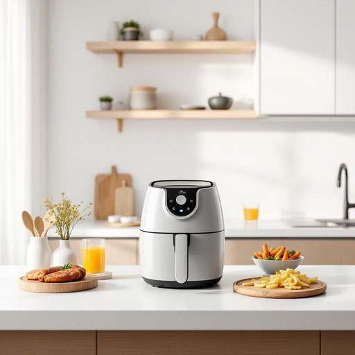

# fryer

<h1 style="font-size: 2.5em; font-weight: 300; letter-spacing: 2px; margin: 0; color: #2c3e50;">
/fraɪər/
</h1>

---

---

## 例句

After we moved into the new flat, I unpacked the fryer, which my sister had insisted we buy because it not only cooks healthier meals with less oil but also comes with several attachments for grilling and baking, making it an indispensable gadget in our kitchen.

*After(/ˈæftər/) we(/wi/) moved(/muvd/) into(/ˈɪntu/) the(/ðə/) new(/nu/) flat,(/flæt,/) I(/aɪ/) unpacked(/ənˈpækt/) the(/ðə/) fryer,(/fraɪər,/) which(/wɪʧ/) my(/maɪ/) sister(/ˈsɪstər/) had(/hæd/) insisted(/ˌɪnˈsɪstɪd/) we(/wi/) buy(/baɪ/) because(/bɪˈkəz/) it(/ɪt/) not(/nɑt/) only(/ˈoʊnli/) cooks(/kʊks/) healthier(/ˈhɛlθiər/) meals(/milz/) with(/wɪθ/) less(/lɛs/) oil(/ɔɪl/) but(/bət/) also(/ˈɔlsoʊ/) comes(/kəmz/) with(/wɪθ/) several(/ˈsɛvərəl/) attachments(/əˈtæʧmənts/) for(/fər/) grilling(/ˈgrɪlɪŋ/) and(/ənd/) baking,(/ˈbeɪkɪŋ,/) making(/ˈmeɪkɪŋ/) it(/ɪt/) an(/ən/) indispensable(/ˌɪndɪˈspɛnsəbəl/) gadget(/ˈgæʤət/) in(/ɪn/) our(/ɑr/) kitchen.(/ˈkɪʧən./)*

**翻译：** 搬进新公寓后，我拆开了空气炸锅，这是我妹妹坚持要我们买的。它不仅能用更少的油烹饪出更健康的餐点，还配备了多种烤烤和烘焙的附件，成为我们厨房里不可或缺的多功能小家电。

---

## 解释

英语单词“fryer”作为名词在家居生活用品的语境中，主要指用于油炸食物的电器设备，即“油炸锅”或“油炸机”，常见的有“deep fryer”（深油炸锅）。使用场合通常是厨房，尤其是在准备炸薯条、鸡翅等油炸食品时出现。这一词汇在语法上是可数名词，通常前面会有冠词或数量词，如“a fryer”或“two fryers”，且常与“deep”、“air”、“electric”等形容词搭配，用以描述不同类型的油炸锅。学习者应注意该词用作名词时的单复数变化（fryer/fryers）以及与其搭配的形容词，表达时常见的表达技巧包括“to use a fryer”，“buy a fryer”以及“clean the fryer”等短语。词源方面，“fryer”源于动词“fry”，意为“油炸，煎炸”，加上表示工具或人者的后缀“-er”，原意即为“炸东西的人或工具”。在现代家居用品语境中，显然指设备而非人。中文语境中，“fryer”准确翻译为“油炸锅”或“炸锅”，具体根据设备类型也可称为“空气炸锅”等，理解时需结合上下文，避免误解为油炸食品或炸物本身。该词本身无明显褒贬色彩，属中性词，具有实用且具体的生活意义，反映现代厨房中常见的烹饪器具。

---

<small style="color: #999; font-size: 0.9em;">2025-07-27 09:14:04</small>

