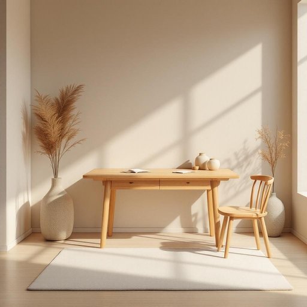

# furniture

<h1 style="font-size: 2.5em; font-weight: 300; letter-spacing: 2px; margin: 0; color: #2c3e50;">
/ˈfərnɪʧər/
</h1>

---

---

## 例句

Although the knowledge presented in the article was extensive, the think tags embedded within the text distracted readers, prompting the editors to remove all think elements to enhance clarity and comprehension.

*Although(/ˌɔlˈðoʊ/) the(/ðə/) knowledge(/ˈnɑlɪʤ/) presented(/pərˈzɛnəd/) in(/ɪn/) the(/ðə/) article(/ˈɑrtɪkəl/) was(/wɑz/) extensive,(/ɪkˈstɛnsɪv,/) the(/ðə/) think(/θɪŋk/) tags(/tægz/) embedded(/ɛmˈbɛdɪd/) within(/wɪˈθɪn/) the(/ðə/) text(/tɛkst/) distracted(/dɪˈstræktɪd/) readers,(/ˈridərz,/) prompting(/ˈprɑmptɪŋ/) the(/ðə/) editors(/ˈɛdɪtərz/) to(/tɪ/) remove(/riˈmuv/) all(/ɔl/) think(/θɪŋk/) elements(/ˈɛləmənts/) to(/tɪ/) enhance(/ɛnˈhæns/) clarity(/ˈklɛrɪti/) and(/ənd/) comprehension.(/ˌkɑmpriˈhɛnʃən./)*

**翻译：** 虽然文章中呈现的知识内容丰富，但文中嵌入的思考标签分散了读者的注意力，编辑们因此决定删除所有思考元素，以提升文章的清晰度和可读性。

---

## 解释

英语单词“furniture”作为名词，主要指家居生活用品中的各类家具，如桌子、椅子、床、柜子等，通常用于描述支撑或装饰居住和工作空间的物品，常见于描述家居布置、搬家、装修等语境中。使用时需注意，“furniture”是不可数名词，不能直接与复数形式连用，如不能说“furnitures”，而应使用“pieces of furniture”表示多件家具；此外，习惯搭配包括“piece of furniture”（一件家具）、“office furniture”（办公家具）、“wooden furniture”（木制家具）等，英语学习者需掌握这些固定搭配以避免错误。该词源自中古法语“fourniture”，意指“供应”或“装备”，进而引申为提供家具装备的意思，体现了家具作为居家必备用品的功能。中文语境中，“furniture”一般准确翻译为“家具”，指的是室内配备的各种装饰和实用物品，涵盖广泛但无褒贬色彩，属于中性词汇，强调实用性与装饰性结合，没有特殊文化内涵，使用时需区分家具与一般日用品（如灯具、地毯）等界限，确保表达的准确性。

---

<small style="color: #999; font-size: 0.9em;">2025-07-27 09:14:04</small>

