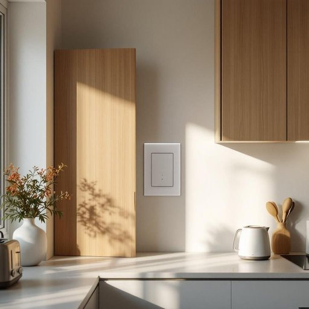

# fuse

<h1 style="font-size: 2.5em; font-weight: 300; letter-spacing: 2px; margin: 0; color: #2c3e50;">
/fjuz/
</h1>

---

---

## 例句

I had to check the fuse in the fuse box, which was cleverly hidden behind the kitchen cupboard, because the kitchen lights, the toaster, and even the electric kettle suddenly stopped working, indicating that the fuse must have blown due to the overload caused by using multiple high-powered appliances at the same time.

*I(/aɪ/) had(/hæd/) to(/tɪ/) check(/ʧɛk/) the(/ðə/) fuse(/fjuz/) in(/ɪn/) the(/ðə/) fuse(/fjuz/) box,(/bɑks,/) which(/wɪʧ/) was(/wɑz/) cleverly(/ˈklɛvərli/) hidden(/ˈhɪdən/) behind(/bɪˈhaɪnd/) the(/ðə/) kitchen(/ˈkɪʧən/) cupboard,(/ˈkəbərd,/) because(/bɪˈkəz/) the(/ðə/) kitchen(/ˈkɪʧən/) lights,(/laɪts,/) the(/ðə/) toaster,(/ˈtoʊstər,/) and(/ənd/) even(/ˈivɪn/) the(/ðə/) electric(/ɪˈlɛktrɪk/) kettle(/ˈkɛtəl/) suddenly(/ˈsədənli/) stopped(/stɑpt/) working,(/ˈwərkɪŋ,/) indicating(/ˈɪndəˌkeɪtɪŋ/) that(/ðət/) the(/ðə/) fuse(/fjuz/) must(/məst/) have(/hæv/) blown(/bloʊn/) due(/du/) to(/tɪ/) the(/ðə/) overload(/ˈoʊvərˌloʊd/) caused(/kɔzd/) by(/baɪ/) using(/ˈjuzɪŋ/) multiple(/ˈməltəpəl/) high-powered(/ˌhaɪˈpaʊərd/) appliances(/əˈplaɪənsɪz/) at(/æt/) the(/ðə/) same(/seɪm/) time.(/taɪm./)*

**翻译：** 我不得不检查保险丝盒中的保险丝，那个盒子巧妙地隐藏在厨房橱柜后面，因为厨房灯、烤面包机甚至电热水壶突然都不工作了，这表明保险丝肯定因同时使用多台大功率电器导致过载而熔断了。

---

## 解释

英语单词“fuse”作为名词在家居生活用品的语境中通常指的是电熔断器即一种用于保护电路安全的装置当电流超过设定值时熔断器内部的细丝会熔断从而切断电流防止电器损坏或火灾发生具体使用场合多见于家庭电器插座电路板等描述的是电路中的安全保护元件英语学习者在使用“fuse”作为名词时需注意其不可数与可数用法通常指代具体的熔断器时作可数名词如a fuse two fuses同时常见搭配包括“blown fuse”（熔断的保险丝）“replace the fuse”（更换保险丝）“fuse box”（配电箱）等此外fuse也可用作动词有“熔合融化”的意思但在家用电器语境中名词用法更为常见词源上“fuse”来源于拉丁语“fusus”意为“纺锤”引申为细长可熔断的金属丝后逐渐专指电路中的保护丝中文语境中“fuse”准确对应的翻译是“熔断器”或“保险丝”强调的是电路安全保护的功能需要避免与“引信”（起爆装置）混淆因两者虽同为fuse但含义不同没有贬义或褒义色彩属于中性技术词汇体现了现代家居电气安全管理的重要组成部分

---

<small style="color: #999; font-size: 0.9em;">2025-07-27 09:14:04</small>

