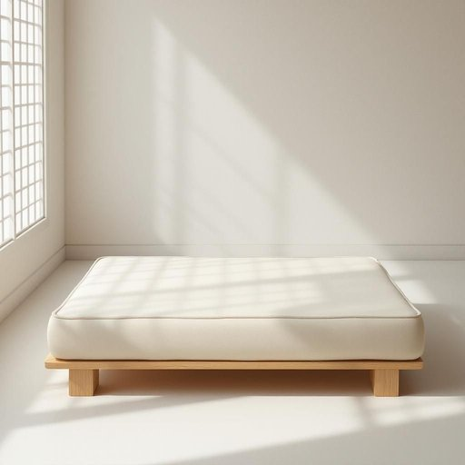

# futon

<h1 style="font-size: 2.5em; font-weight: 300; letter-spacing: 2px; margin: 0; color: #2c3e50;">
/ˈfutɑn/
</h1>

---

---

## 例句

After the intense debate, the committee’s decision became the pivotal factor shaping the future of the project, demonstrating how a single judgment can influence the trajectory of an entire organization.

*After(/ˈæftər/) the(/ðə/) intense(/ˌɪnˈtɛns/) debate,(/dəˈbeɪt,/) the(/ðə/) committee’s(/committee’s*/) decision(/dɪˈsɪʒən/) became(/bɪˈkeɪm/) the(/ðə/) pivotal(/ˈpɪvətəl/) factor(/ˈfæktər/) shaping(/ˈʃeɪpɪŋ/) the(/ðə/) future(/fˈjuʧər/) of(/əv/) the(/ðə/) project,(/ˈprɑʤɛkt,/) demonstrating(/ˈdɛmənˌstreɪtɪŋ/) how(/haʊ/) a(/ə/) single(/ˈsɪŋgəl/) judgment(/ˈʤəʤmənt/) can(/kən/) influence(/ˈɪnfluəns/) the(/ðə/) trajectory(/trəˈʤɛktəri/) of(/əv/) an(/ən/) entire(/ɪnˈtaɪər/) organization.(/ˌɔrgənəˈzeɪʃən./)*

**翻译：** 经过激烈的辩论，委员会的决策成为决定项目未来的关键因素，彰显了判断力如何影响整个组织的发展轨迹。

---

## 解释

英语单词“futon”作为名词，指的是一种源自日本的传统床铺，通常包括一张可折叠的床垫和被褥，其设计便于放置在地板上使用，日常可折叠收纳以节省空间，也常见于现代西方家居中作为沙发床或多功能家具使用。在具体使用场合和语境中，futon多用于描述简约、节省空间的卧具，特别适合小户型或多功能房间，常见于描述卧室、客厅或宿舍等场所。英语学习者需注意，“futon”作为可数名词，其复数形式是“futons”，且在搭配时常见表达有“sleep on a futon”（睡在榻榻米上），“convert the futon into a bed”（将榻榻米变成床）等，能够灵活搭配动词“sleep on”、“sit on”及动词短语“fold up”或“put away”等，表达其可折叠和多用途的特性。词源方面，futon一词直接源自日语“布団”（futon），意指传统的床垫和被褥组合，20世纪中日本文化传入西方时，该词随同这种家具形式进入英语，沿用其发音和含义。在中文语境中，“futon”准确翻译为“榻榻米床垫”或简称“蒲团床垫”，有时泛指类似日式床垫，强调其便携、折叠、简约的特性，但应避免与“榻榻米”（tatami，指铺设地面的编织草席）混淆。该词无明显褒贬色彩，更多体现出文化异域感及生活便利性的中性表达，反映了东西方居住文化的交流与融合，学习和使用时应结合具体家居环境或文化背景准确理解。

---

<small style="color: #999; font-size: 0.9em;">2025-07-27 09:14:04</small>

